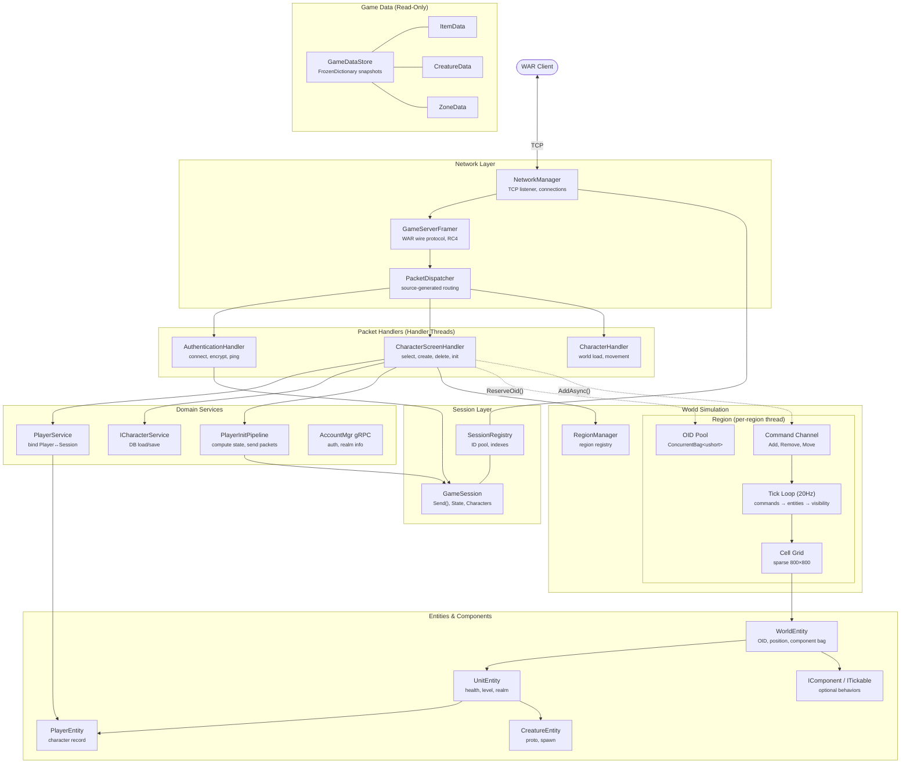
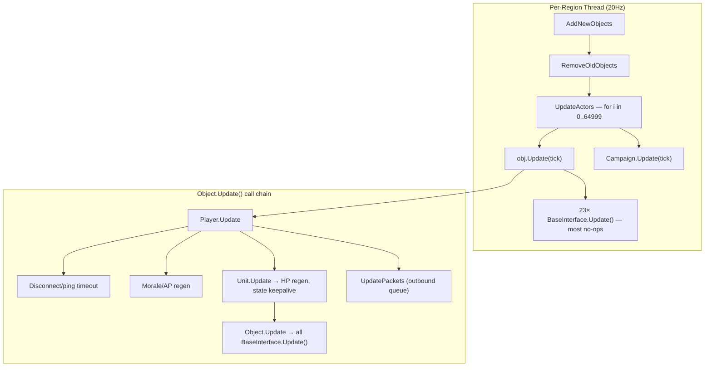
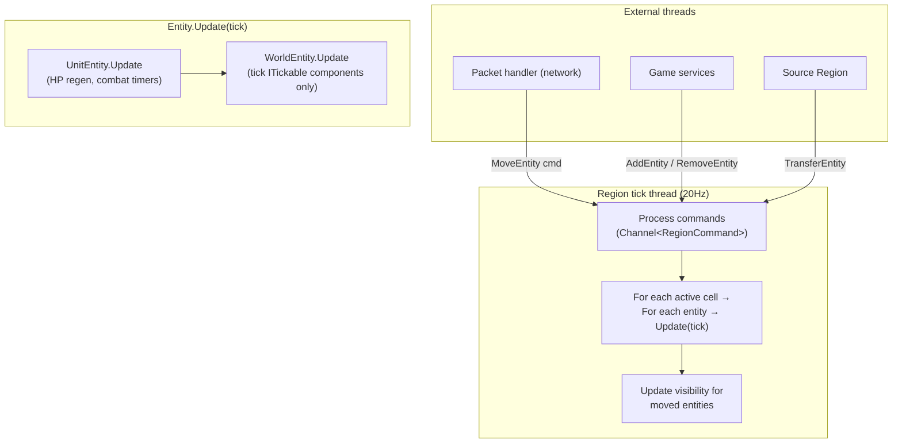
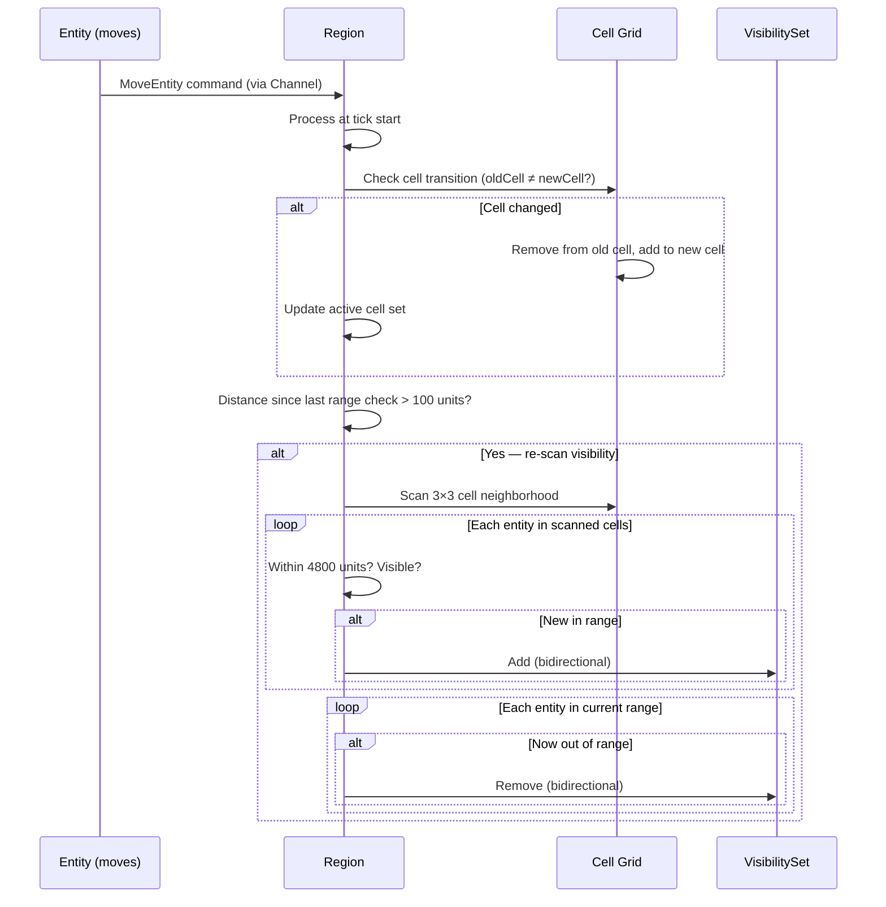
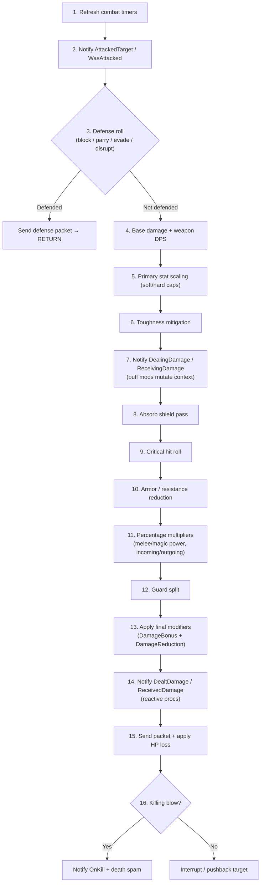

# WorldServerV2 — Architecture & Redesign Context

> **Purpose**: Persistent reference for continuing the incremental rewrite of the
> WAR World Server. This document captures the old architecture's problems, the new
> project's current state, and the full redesign roadmap so any future session can
> resume without re-researching the codebase.
>
> **Last updated**: March 2026

---

## Table of Contents

1. [Why a Separate Project](#1-why-a-separate-project)
2. [Old WorldServer — Architecture Summary](#2-old-worldserver--architecture-summary)
3. [WorldServerV2 — Current State](#3-worldserverv2--current-state)
4. [High-Level Architecture Overview](#4-high-level-architecture-overview)
5. [Glossary of Game Concepts](#5-glossary-of-game-concepts)
6. [Redesign Roadmap](#6-redesign-roadmap)
7. [System 1: Game Data Pipeline](#7-system-1-game-data-pipeline)
8. [System 2: Game Object Model (Entity-Component)](#8-system-2-game-object-model-entity-component)
9. [System 3: World Topology & Update Loop](#9-system-3-world-topology--update-loop)
10. [Player Initialization & Login Flow](#10-player-initialization--login-flow)
11. [System 4: Combat & Ability Engine](#11-system-4-combat--ability-engine)
12. [System 5: AI / Brain System](#12-system-5-ai--brain-system)
13. [System 6: Character Persistence](#13-system-6-character-persistence)
14. [System 7: Group & Warband](#14-system-7-group--warband)
15. [System 8: Guild](#15-system-8-guild)
16. [System 9: RvR / Campaign](#16-system-9-rvr--campaign)
17. [System 10: Quests](#17-system-10-quests)
18. [System 11: Scenarios](#18-system-11-scenarios)
19. [System 12: Economy (AH, Mail, Trade)](#19-system-12-economy-ah-mail-trade)
20. [System 13: NPC & Static Object Spawning](#20-system-13-npc--static-object-spawning)
21. [Cross-Cutting Design Principles](#21-cross-cutting-design-principles)
22. [Shared Infrastructure Projects](#22-shared-infrastructure-projects)

---

## 1. Why a Separate Project

The old `WorldServer` project is ~120K lines across 501 files with deeply
inter-dependent static state, no DI, and no tests. Attempting to refactor in-place
would require touching hundreds of files per change, with no safety net.

`WorldServerV2` is a standalone executable that:

- **Shares** the infrastructure crates (`Core.Infrastructure.Network`,
  `Core.Infrastructure.Cryptography`, `Core.Infrastructure.Network.RpcSourceGenerators`,
  `Core.Entities`, `Core.Accounts`, `Common`)
- Re-implements game systems from scratch with clean architecture
- Can be verified against the old server for behavioral parity (integration tests
  send identical packets and compare responses)
- Allows breaking changes to domain types without destabilising the running old server

---

## 2. Old WorldServer — Architecture Summary

### 2.1 Project Stats

| Metric | Value |
|--------|-------|
| Total .cs files | 501 |
| Total lines | ~119,596 |
| Largest file | `BaseCommands.cs` — 4,194 lines |
| God classes (>1K lines) | Player (6,837), BuffInterface (3,859), Guild (3,145), ItemsInterface (2,704), CombatManager (2,376), BattleFrontKeep (2,103), Group (2,043), ScenarioMgr (1,961), WorldMgr (1,681), CharMgr (1,692), CommandMgr (1,714) |

### 2.2 Game Object Hierarchy

```
Point3D (FrameWork)
 └── Object (826 lines) — base world entity with OID, position, cell membership
       └── Unit (1,545 lines) — health, stats, combat state, 9 interfaces
             ├── Player (6,837 lines) — 14 additional interfaces, 23 total
             ├── Creature (1,463 lines) → Pet, Standard, Boss, KeepCreature, ...
             ├── GameObject (793 lines) → LootChest, GoldChest, KeepGameObject
             └── PublicQuest (1,015 lines)
       └── BattleFrontObjective → BattleFrontKeep (2,103 lines)
       └── BattlefieldObjective, ChapterObject, HotSpot, RvRStructure, Siege
```

Each `Unit` has up to 23 `BaseInterface` components (`CombatInterface`,
`BuffInterface`, `ItemsInterface`, `AbilityInterface`, etc.) registered in a `List<BaseInterface>`
and **all ticked every frame** — even idle players.

### 2.3 World Topology

| Layer | Class | State |
|-------|-------|-------|
| World | `WorldMgr` (static, 1,681 lines) | `_Regions` list, `_Keeps` dict, `LocalScripts`, `GlobalScripts`, 10+ other statics |
| Region | `RegionMgr` (923 lines) | Dedicated `Thread`, 50ms tick, `Objects[65000]` fixed array, `CellMgr[800,800]` grid |
| Zone | `ZoneMgr` (231 lines) | `List<Player>`, hotspot heatmap, PQuests |
| Cell | `CellMgr` (100 lines) | `List<Object>` (no lock), lazy-loaded spawns |

**Tick architecture**: Three independent timer-based threads:

| Thread | Interval | Responsibility |
|--------|----------|----------------|
| Region (1 per region) | 50ms | `AddNewObjects → RemoveOldObjects → UpdateActors → Campaign.Update` |
| World | 15s | Zone fight-level broadcast, heatmap decay |
| Group | 250ms | Process `_pendingGroupActions`, update groups/warbands |

### 2.4 Managers / Static Singletons

Nearly all state management lives in static classes:

| Manager | Lines | Key State |
|---------|-------|-----------|
| `WorldMgr` | 1,681 | `_Regions`, `_Keeps`, scripts, scenarios, campaigns |
| `CharMgr` | 1,692 | 13 static dictionaries (character templates, items, names, stats) |
| `CommandMgr` | 1,714 | All slash commands, social/guild commands inline |
| `AbilityMgr` | 692 | 11 static dictionaries (abilities, buffs, modifiers, knockbacks) |
| `LootsMgr` | 660 | Loot generation |
| `ScenarioMgr` | 1,961 | Queue management for matchmaking |
| `InstanceMgr` | 734 | Instance dungeon management |

### 2.5 Data Loading Pipeline (Old)

27 static `*Service` classes discovered via reflection (`[Service(...)]` + `[LoadingFunction]`):

```
AnnounceService, BagService, BattlefrontService, BountyService, CellSpawnService,
ChapterService, CreatureService, DyeService, GameObjectService, GuildService,
HonorService, InstanceService, ItemService, LiveEventService, MailService,
PQuestService, QuestService, RallyPointService, RewardService,
RVRProgressionService, RVRZoneRewardService, ScenarioService, TokService,
VendorService, WaypointService, XpRenownService, ZoneService
```

All follow the same pattern:
```csharp
public static class ItemService {
    public static Dictionary<uint, Item_Info> _Item_Info;
    [LoadingFunction(true)]
    public static void LoadItem_Info() {
        _Item_Info = Database.SelectAllObjects<Item_Info>()...;
    }
}
```

Cross-linking happens in `WorldMgr.LoadRelation()` — a single 400+ line method.

### 2.6 Combat & Abilities

| File | Lines | Role |
|------|-------|------|
| `CombatManager.cs` | 2,376 | Static class — all damage formula math |
| `AbilityProcessor.cs` | 978 | Ability execution pipeline |
| `AbilityInterface.cs` | 1,338 | Per-unit ability state (cooldowns, casting) |
| `BuffInterface.cs` | 3,859 | Per-unit buff management (god class) |
| `AbilityEffectInvoker.cs` | 558 | Effect dispatch via reflection |
| `AbilityModifierInvoker.cs` | 943 | Modifier dispatch via reflection |

17 career-specific `CareerInterface_*.cs` files.

### 2.7 Social Systems

| System | Key File | Lines | Issues |
|--------|---------|-------|--------|
| Groups | `Group.cs` | 2,043 | Static `WorldGroups` list + `_pendingGroupActions` queue |
| Warbands | `WarbandHandler.cs` | 760 | 4 Groups glued together, `ReaderWriterLockSlim` |
| Guilds | `Guild.cs` | 3,145 | Monolithic: ranks, permissions, tax, vaults, heraldry, alliances |

### 2.8 RvR / Campaign

`Campaign.cs` (1,474 lines) — per-region, tightly coupled to `WorldMgr` statics.
`BattleFrontKeep.cs` (2,103 lines) — both world entity and strategic state machine.
**Bright spot**: The Bounty subsystem (`BountyManager`, `ContributionManager`,
`ImpactMatrixManager`, `RewardManager`) uses proper interfaces — best-structured code.

### 2.9 Thread Safety (Old)

| Pattern | Where Used |
|---------|------------|
| Dedicated `Thread` | 1 per region, 1 for groups, 1 for world updates |
| `lock()` | `Player._Players`, `Group.WorldGroups`, `AuctionHouse.Auctions`, object add/remove |
| `ReaderWriterLockSlim` | `WorldMgr.RegionsRWLock`, `WarbandHandler._membersRWLock` |
| `ConcurrentDictionary` | `CharMgr.CharacterStartingItems`, `Campaign.OrderPlayerPopulationList` |
| **No synchronization** | Most `CellMgr` lists, many `CharMgr` dicts, all `AbilityMgr` dicts |

---

## 3. WorldServerV2 — Current State

### 3.1 Project Structure (as of March 2026)

```
src/WorldServerV2/
├── Program.cs                          — Stub (Hello World)
├── WorldServerV2.csproj                — net10.0, refs: Common, Crypto, Network, RpcGen, gRPC
├── Data/
│   ├── IGameDataStore.cs              — Read-only facade over all static game data
│   ├── GameDataStore.cs               — Concrete impl with immutable Snapshot + atomic swap
│   ├── IDataProvider.cs               — Generic provider contract (IDataProvider<TData>)
│   ├── GameDataLoader.cs              — IHostedService that orchestrates loading at startup
│   ├── GameDataServiceExtensions.cs   — AddGameData() DI registration
│   ├── Domain/
│   │   ├── ItemData.cs                — FrozenDictionary<uint, Item_Info>
│   │   ├── CreatureData.cs            — FrozenDictionary<uint, Creature_proto> + Spawns
│   │   └── ZoneData.cs               — FrozenDictionary<ushort, Zone_Info> + Jumps
│   └── Providers/
│       ├── ItemDataProvider.cs        — Loads items from IObjectDatabase
│       ├── CreatureDataProvider.cs    — Loads creatures + cross-links Spawn.Proto
│       └── ZoneDataProvider.cs        — Loads zones, filters disabled jumps
├── Network/
│   ├── ClientState.cs                  — enum: NotConnected → WorldEnter → Playing → Disconnected
│   ├── GameClientConnectionContext.cs  — Extension members on IConnectionContext (Session, Account, ClientId)
│   ├── GameServerContext.cs            — [PacketSerializerContext] for source-generated serializer
│   ├── GameServerFramer.cs             — IPacketFramer: WAR wire protocol (RC4, checksum)
│   ├── GameServerSerializer.cs         — Manual binary serializer (EncryptKey only)
│   ├── GameSession.cs                  — Session mediator (ushort Id, Send<T>, Disconnect)
│   ├── GameSessionServiceExtensions.cs — AddGameSessions() DI registration
│   ├── Opcodes.cs                      — Full opcode enum (0x00–0xFF)
│   ├── SessionLifecycleService.cs      — IHostedService: wires NetworkManager events → SessionRegistry
│   ├── SessionRegistry.cs             — Singleton: Stack<ushort> ID pool, ConcurrentDictionary indexes
│   ├── SpanExtensions.cs              — Fletcher-like checksum
│   ├── Handlers/
│   │   └── AuthenticationHandler.cs   — F_ENCRYPTKEY, F_CONNECT, F_PING, F_DISCONNECT, F_PLAYER_ENTER_FULL, F_PLAYER_EXIT, F_REQUEST_CHAR
│   └── Dtos/
│       ├── ConnectRequest.cs / ConnectResponse.cs
│       ├── EncryptKeyRequest.cs / EncryptKeyResponse.cs
│       ├── PingRequest.cs / PingResponse.cs
│       ├── PlayerEnterRequest.cs / PlayerEnterResponse.cs
│       ├── PlayerExitRequest.cs / PlayerQuitResponse.cs
│       └── RequestCharacterRequest.cs / RequestCharacterResponse.cs / RequestCharacterErrorResponse.cs
├── Services/
│   ├── ICharacterService.cs           — Interface: LoadCharactersForAccount, GetAccountRealm
│   └── PlayerService.cs              — Bind/Unbind PlayerEntity↔Session, ConcurrentDictionary indexes
└── World/
    ├── Components/
    │   ├── IComponent.cs              — Optional behaviour contract + ComponentBase convenience class
    │   ├── ITickable.cs               — Opt-in tick interface for optional components
    │   └── HealthComponent.cs         — HP pool (standalone class, direct field on UnitEntity)
    └── Entities/
        ├── EntityType.cs              — enum: Player, Creature, Pet, GameObject, Siege, PublicQuest, Keep
        ├── WorldEntity.cs             — Abstract base: ObjectId, Name, Position, optional component bag
        ├── WorldPosition.cs           — readonly record struct: X, Y, Z, Heading, ZoneId
        ├── UnitEntity.cs              — Abstract: Health (direct), Level, Realm, Faction
        ├── PlayerEntity.cs            — Sealed: Character record, CharacterId, DisconnectType
        ├── CreatureEntity.cs          — Sealed: Proto, Spawn, Entry
        ├── PetEntity.cs               — Sealed: Proto, Spawn, Owner
        ├── GameObjectEntity.cs        — Sealed: Entry, VfxState, Interactable
        └── DisconnectType.cs          — enum: Unclean, Clean, Crash
```

### 3.2 Key Design Decisions Already Made

| Decision | Rationale |
|----------|-----------|
| `GameSession` hides `IConnectionContext` — game code only sees `Send<T>()` + `Disconnect()` | Law of Demeter; prevents game code from depending on transport internals |
| Session IDs are `ushort` (1–65535) with a recycling `Stack<ushort>` pool | Protocol requires uint16 SessionID; pool gives O(1) alloc/free with no wraparound bugs |
| `SessionRegistry` + `PlayerService` are singletons with `Lock`-serialized writes, lock-free reads | Writes are rare (connect/disconnect); reads happen every packet and every tick |
| `ICharacterService` interface rather than static `CharMgr` | Enables DI, testability, separation of data access from business logic |
| `AuthenticationHandler` injects `AccountMgr.AccountMgrClient` (gRPC) directly | No more coupling to static `Core.AcctMgr`; testable with gRPC mocks |
| Player does NOT live on GameSession | Lifecycle mismatch (session outlives individual characters); `PlayerService` maps between them |
| `RealmInfo` is an injected value object, not `Core.Rm` static | Clean DI, no hidden global state |

### 3.3 Dependencies

```
WorldServerV2 → Common                         (shared entities: Character, Item_Info, etc.)
              → Core.Infrastructure.Network     (NetworkManager, ClientConnection, IConnectionContext, IPacketFramer, etc.)
              → Core.Infrastructure.Cryptography (MythicRc4)
              → Core.Infrastructure.Network.RpcSourceGenerators (source generator for [Rpc] dispatch)
              → Grpc.Net.Client                 (AccountMgr gRPC client)
              → Npgsql.EntityFrameworkCore.PostgreSQL (EF Core 10, WorldDbContext)
```

### 3.4 Integration Tests (in `test/WorldServer.Tests/`)

Currently targets the old WorldServer project. The test infrastructure is designed to
be reusable for WorldServerV2:

| File | Purpose |
|------|---------|
| `Integration/GameServerTestHarness.cs` | Boots real `NetworkManager` on ephemeral port with full DI |
| `Integration/GameClientSimulator.cs` | Raw `TcpClient` that speaks WAR wire protocol |
| `Integration/TestPacketDispatcher.cs` | Minimal `IPacketDispatcher` for test (F_ENCRYPTKEY + F_DISCONNECT) |
| `Integration/NetworkSmokeSuite.cs` | 9 tests: connect/disconnect lifecycle, encrypt handshake, concurrency |

---

## 4. High-Level Architecture Overview

### 4.1 Architecture Diagram



### 4.2 Component Responsibilities

| Component | Type | Responsibility |
|-----------|------|----------------|
| **NetworkManager** | Infrastructure | Accepts TCP connections, manages connection lifecycle, dispatches raw bytes to the framer/serializer pipeline. |
| **GameServerFramer** | Infrastructure | Implements the WAR wire protocol — packet framing (`[u16 size][u8 opcode][payload]`), RC4 encryption/decryption, checksum validation. |
| **PacketDispatcher** | Infrastructure (generated) | Source-generated routing table that maps inbound opcodes to `[Rpc]`-attributed handler methods. Deserializes request DTOs, invokes the handler, serializes response DTOs. |
| **SessionRegistry** | Singleton | Manages the pool of `ushort` session IDs and indexes active sessions. O(1) alloc/free via `Stack<ushort>`. |
| **GameSession** | Per-connection | Mediator between network transport and game logic. Exposes `Send<T>()` (thread-safe, channel-backed), holds `ClientState`, character list, and account reference. Game code never touches raw `IConnectionContext`. |
| **Packet Handlers** | Scoped (per-request) | Stateless request handlers annotated with `[Rpc(in, out)]`. Receive deserialized DTOs, inject services via `[FromServices]`, return response DTOs. All game-triggered I/O and orchestration lives here. |
| **PlayerService** | Singleton | Bidirectional `PlayerEntity` ↔ `GameSession` binding. `ConcurrentDictionary` indexes for O(1) lookup by session or character ID. |
| **ICharacterService** | Singleton (interface) | Character CRUD and DB loading. Async methods for loading the full character graph (character + value + items + future systems). |
| **PlayerInitPipeline** | Singleton | Orchestrates the login packet sequence (Phase B compute + Phase C serialize). Runs on the handler thread while the client is on a loading screen. Evolves into thin service-call orchestration as domain services are built. |
| **GameDataStore** | Singleton | Immutable snapshot of all static game data (`FrozenDictionary` collections). Loaded at startup by `GameDataLoader`. Provides `.Items`, `.Creatures`, `.Zones`, etc. |
| **RegionManager** | Singleton | Registry of `Region` instances. `GetOrCreate(ushort)` for lazy creation. |
| **Region** | Per-region (owns thread) | Spatial container: sparse cell grid, OID pool, command channel, 20Hz tick loop. Processes add/remove/move commands, ticks active entities, updates visibility. Single-threaded — all mutation happens on the region thread. |
| **Cell** | Per-cell (within Region) | Fixed-size spatial bucket (4096×4096 game units). Holds entity lists. Lazy-allocated on first player proximity. Tracks active (has players) and loaded (spawns materialized) state. |
| **VisibilitySet** | Per-entity | `HashSet`-backed range cache tracking which entities are visible to this entity. `internal` write access (region thread only), public read. Separate `Players` set avoids type checks on the packet dispatch hot path. |
| **WorldEntity** | Abstract base | Identity (OID, name), position (`WorldPosition`), optional `IComponent` bag. `Update(tick)` iterates only `ITickable` components. |
| **UnitEntity** | Abstract (extends WorldEntity) | Combat-capable entity. Direct fields: `HealthComponent`, `Level`, `Realm`, `Faction`. |
| **PlayerEntity** | Sealed leaf | Human-controlled unit. Holds the DB `Character` record, `CharacterId`, `DisconnectType`. Thin data holder — logic lives in services. |
| **CreatureEntity** | Sealed leaf | NPC mob. Holds `CreatureProto` (template), `CreatureSpawn` (instance), `Entry`. |
| **IComponent / ITickable** | Interface | Optional behaviors attached to entities at runtime. `ComponentBase` manages the `Owner` back-reference. `ITickable` components are ticked each frame; non-tickable components are passive state holders. |
| **HealthComponent** | Direct field on UnitEntity | HP pool: `Current`, `Max`, `TakeDamage()`, `Heal()`, `Resurrect()`. Not in the optional component bag — required for all units. |
| **RealmInfo** | Value object (injected) | Server identity: realm ID, name. Replaces the old static `Core.Rm`. |

### 4.3 Data Flow Summary

| Flow | Path | Threading |
|------|------|-----------|
| **Inbound packet** | Client → TCP → `GameServerFramer` (decrypt + deframe) → `PacketDispatcher` (route) → Handler method | Network I/O thread → handler thread pool |
| **Outbound packet** | Handler/Service calls `session.Send<T>()` → channel enqueue → `GameServerFramer` (serialize + encrypt) → TCP | Any thread → network I/O thread |
| **Entity mutation (gameplay)** | Handler enqueues `RegionCommand` → Region tick drains command → mutates entity on region thread | Handler thread → region thread (via Channel) |
| **Entity tick** | Region tick loop → active cells → `entity.Update(tick)` → `ITickable` components | Region thread only |
| **Visibility update** | Entity moves > 100 units → region re-scans 3×3 cell neighborhood → bidirectional add/remove on `VisibilitySet` | Region thread only |
| **Player login** | Handler thread: load DB → compute state → send packets → `AddAsync()` → region places entity → handler sends INIT_COMPLETE | Handler thread + one region-thread command |

---

## 5. Glossary of Game Concepts

| Term | Definition |
|------|------------|
| **Region** | The top-level spatial container. Each region runs on its own dedicated thread with a 20Hz tick loop. A region owns a sparse cell grid, an OID pool, and processes all entity mutations via a command channel. In WAR, each major geographical area (e.g. "Tier 1 shared starting area") is a region. The `characterinfo.RegionId` column determines which region manages a character. |
| **Zone** | A named sub-area within a region (e.g. "Ekrund", "Mt. Bloodhorn", "Nordland"). Zones define their own coordinate offset (`OffX`, `OffY`) within the region and a **client-facing Region ID** (`zone_infos.Region`) that tells the client which terrain/map to load. Multiple zones can share one server-side region. |
| **Cell** | A fixed-size spatial bucket within a region's grid. Each cell is 4096×4096 game units (~341×341 feet). The grid is 800×800 but sparse — cells are only allocated when an entity enters. Cells track entity lists and whether they are active (contain players) or loaded (spawn data materialized). |
| **OID (Object ID)** | A `ushort` (1–65535) that uniquely identifies an entity within a region. Assigned from a `ConcurrentBag<ushort>` pool via `Region.ReserveOid()`. Returned to the pool when the entity is removed. OIDs are region-scoped — two entities in different regions can share the same OID. |
| **World-Absolute Coordinates** | The region-wide X/Y position of an entity, stored as `int`. This is the primary coordinate system used internally. All distance checks, cell lookups, and spatial queries use world-absolute coordinates. Stored in the DB as `characterinfo.WorldX` / `WorldY`. |
| **Zone-Local Coordinates** | X/Y coordinates relative to a zone's origin. Computed as `WorldX - (OffX × 4096)`. Used at the network boundary when the client needs zone-relative positions (e.g. for terrain alignment). Derived on demand via `WorldPosition.ToZoneLocal()` — never stored internally. |
| **Zone Offset (OffX / OffY)** | Integer multipliers from `zone_infos` that define a zone's origin in world-absolute space. The zone origin is `(OffX × 4096, OffY × 4096)`. Example: Zone "Nordland" has `OffX=200`, so its origin X is 819,200. |
| **Client Region ID** | The `zone_infos.Region` value sent to the client in `S_PLAYER_INITTED`. Tells the client which terrain map to load. This may differ from the server-side region that manages the entity. Example: Greenskin starting zones have client Region ID = 1 but are managed by server Region 8. |
| **Server Region ID** | The `characterinfo.RegionId` value used server-side to determine which `Region` instance manages the entity. All starting characters currently use Region 8. |
| **Entity** | Any object in the game world with an OID and a position: players, creatures, pets, game objects, siege weapons, public quests, keeps. Represented by the `WorldEntity` hierarchy. |
| **IsActive** | A per-entity flag (`WorldEntity.IsActive`) that gates whether a player receives visibility notifications and state broadcasts. NPCs/creatures/game objects default to `true`; players default to `false` and are activated when the client sends `F_DUMP_STATICS` (0x0D) after finishing the world load. This prevents the client from receiving entity-create packets before the loading screen has finished. The region thread flips this flag via the `ActivateEntity` command, then re-sends create packets for all entities already in the player's visibility set. |
| **Component** | An optional behavior or state container that can be attached to an entity at runtime. Implements `IComponent`. Components that need per-tick updates also implement `ITickable`. Components that need to send follow-up packets when an entity becomes visible implement `IVisibilityInitContributor`. Required state (like health) is a direct field, not a component. |
| **IVisibilityInitContributor** | A component interface whose `SendVisibilityInit(session)` method is called by the region after each entity-create packet (`F_CREATE_MONSTER` / `F_CREATE_STATIC`). Allows components to send follow-up packets (e.g. `F_PLAYER_INVENTORY` for equipment) without the region needing to know about specific component types. Current implementor: `EquipmentComponent`. |
| **EquipmentComponent** | An `IVisibilityInitContributor` attached to creatures with visual equipment (from the `creature_items` table). Sends `F_PLAYER_INVENTORY` with equipped item slots on visibility. **Tech debt**: primary/secondary color fields are loaded but not yet serialized — the source generator's `[ConditionalOn]` only supports equality (not bitwise flags). |
| **Tick** | One iteration of a region's update loop. Runs at 20Hz (50ms interval). Processes pending commands, updates entities in active cells, and refreshes visibility sets. |
| **Visibility Set** | Per-entity cache of nearby entities within the max visibility range (4800 units / ~400 feet). Updated when an entity moves more than 100 units. Used to determine which entities a player can see and which players need to receive packets about an entity. |
| **Active Cell** | A cell containing at least one player. Only active cells and their 3×3 neighborhood are ticked each frame — empty cells have zero cost. |
| **Command Channel** | A `Channel<RegionCommand>` that allows handler threads and services to safely enqueue mutations (add, remove, move, transfer) for the region thread to process at the start of each tick. |
| **Handler Thread** | A thread-pool thread that executes packet handler methods. Stateless — each `[Rpc]` method receives a deserialized request DTO, performs work (possibly async), and returns a response DTO. Handler threads may read entity state but mutate it only via region commands. |
| **Realm** | The player's faction: Order (1) or Destruction (2). Determines enemies, allies, starting zones, and career availability. |
| **Career** | The player's class/profession (e.g. Black Orc, Bright Wizard, Warrior Priest). Determines abilities, stats, armor type, and mastery trees. A `byte` value (20–107) from the `characterinfo` table. |
| **Session** | A `GameSession` instance representing one authenticated client connection. Holds the session ID, client state machine, character list, and a thread-safe send channel. A session can outlive individual characters (e.g. character select → play → return to select). |
| **OidReservation** | A disposable ticket returned by `Region.ReserveOid()`. Ensures the OID is returned to the pool if initialization fails (via `using`). Consumed by `Region.AddAsync()` on success — subsequent disposal is a no-op. |

---

## 6. Redesign Roadmap

Ordered by dependency — foundational systems first, each unblocking the next tier.

```
Phase 1 (Foundation):
  [1] Game Data Pipeline       — how static game data is loaded, stored, and accessed
  [2] Game Object Model        — entity/component design replacing the deep hierarchy
  [3] World Topology & Tick    — regions, cells, spatial queries, update scheduler

Phase 1.5 (Player Login — unblocks Phase 2 testing):
  [→] Player Initialization    — login flow, init pipeline, character load-to-world

Phase 2 (Core Gameplay):
  [4] Combat & Abilities       — damage pipeline, buff system, ability processor
  [5] AI / Brain System        — behavior trees, decision/action separation
  [6] Character Persistence    — character CRUD, caching, load-on-login lifecycle

Phase 3 (Social & Competitive):
  [7] Group & Warband          — membership, loot distribution, XP sharing
  [8] Guild                    — roster, vaults, heraldry, alliances
  [9] RvR / Campaign           — capture mechanics, keep management, VP tracking

Phase 4 (Supporting):
  [10] Quests                  — quest data, tracking, objective evaluation
  [11] Scenarios               — matchmaking, instanced regions, scoring
  [12] Economy (AH/Mail/Trade) — indexed auction search, mail delivery pipeline
```

---

## 7. System 1: Game Data Pipeline

**Problem**: 27 static service classes load data into static dictionaries. No DI, no
thread safety for reload, no separation of data access from domain logic. Cross-linking
lives in a single 400+ line method.

**New design direction**:

| Concern | Old | New |
|---------|-----|-----|
| Storage | `static Dictionary<uint, Item_Info>` on `ItemService` | Typed read-only collections on an injectable `IGameDataStore` |
| Loading | Reflection-discovered `[LoadingFunction]` methods | Explicit startup pipeline via `IHostedService` with ordered phases |
| Cross-linking | `WorldMgr.LoadRelation()` monolith | Post-load composition step with declared dependencies |
| Reload | Ad-hoc `ReloadAbilities()` clears and reloads | Versioned snapshot swap — build new store, atomically swap ref |
| Access | `ItemService._Item_Info[id]` (static field) | `gameDataStore.Items[id]` (injected interface) |
| Thread safety | Inconsistent (some locks, most none) | Immutable collections after load — zero contention |

**Key types to introduce**:

- `IGameDataStore` — readonly facade: `.Items`, `.Creatures`, `.Abilities`, `.Zones`, etc.
- `GameDataStore` — concrete implementation holding `FrozenDictionary` or `ReadOnlyDictionary` collections
- `GameDataLoader` — `IHostedService` that orchestrates DB reads and builds the store
- Per-domain data providers (e.g. `ItemDataProvider`, `AbilityDataProvider`) injected into `GameDataLoader`
  for separation of loading logic

**Status**: ✅ Phase 1 complete — infrastructure + 3 domains (Items, Creatures, Zones).

**Implemented files** (`src/WorldServerV2/Data/`):

| File | Purpose |
|------|---------|
| `IGameDataStore.cs` | Read-only facade interface |
| `GameDataStore.cs` | Concrete impl with immutable `Snapshot` + atomic swap |
| `IDataProvider.cs` | Generic provider contract (`IDataProvider<TData>`) |
| `GameDataLoader.cs` | `IHostedService` that orchestrates providers at startup |
| `GameDataServiceExtensions.cs` | DI registration (`services.AddGameData()`) |
| `Domain/ItemData.cs` | `FrozenDictionary<uint, ItemInfo>` (EF Core POCO) |
| `Domain/CreatureData.cs` | `FrozenDictionary<uint, CreatureProto>` + `FrozenDictionary<uint, CreatureSpawn>` |
| `Domain/ZoneData.cs` | `FrozenDictionary<ushort, ZoneInfo>` + `FrozenDictionary<uint, ZoneJump>` |
| `Providers/ItemDataProvider.cs` | Loads items from `WorldDbContext` (EF Core) |
| `Providers/CreatureDataProvider.cs` | Loads creatures + cross-links `CreatureSpawn.Proto` |
| `Providers/ZoneDataProvider.cs` | Loads zones, filters disabled jumps |

**Tests**: 10 tests in `GameDataPipelineTests.cs` (store lifecycle, provider loading, cross-linking, loader orchestration).

**Next steps**: Add domains incrementally (Quests, Abilities, PQuests, Battlefront, etc.) following the same `IDataProvider<TData>` pattern.

---

## 8. System 2: Game Object Model (Entity Hierarchy + Composition)

**Problem**: Deep 6+ level inheritance tree. `Player.cs` is 6,837 lines. 23
`BaseInterface` components ticked every frame even when idle. Pervasive `is Player` /
`is Creature` type checks.

**New design direction**: Shallow sealed hierarchy for **required** state (compile-time
safety), with an optional component bag for **dynamic** behaviors.

| Concern | Old | New |
|---------|-----|-----|
| Identity | Runtime type (`is Player`) | Concrete subclass + `EntityType` discriminator |
| Required state | Scattered across 23 `BaseInterface` components | Direct fields on typed entity subclasses |
| Optional behaviors | `BaseInterface` subclasses, all ticked | `IComponent` bag — opt-in attach/detach, `ITickable` tick only when present |
| Health | `Unit.Health` field (always present for units) | `UnitEntity.Health` direct field (never null) |
| Player | 6,837-line god class | `PlayerEntity` sealed class with thin direct fields; logic in focused services/components |
| Global lists | `static Player._Players`, `Player.PlayersByCharId` | `PlayerService` singleton (typed to `PlayerEntity`) |

**Hierarchy**:

```
WorldEntity (abstract) — ObjectId, Name, Position, optional component bag
├── UnitEntity (abstract) — Health (HealthComponent, direct field), Level, Realm, Faction
│   ├── PlayerEntity (sealed) — Character record, CharacterId, DisconnectType
│   ├── CreatureEntity (sealed) — CreatureProto, CreatureSpawn, Entry
│   └── PetEntity (sealed) — CreatureProto, CreatureSpawn, Owner
└── GameObjectEntity (sealed) — Entry, VfxState, Interactable
```

**Key design decisions**:

| Decision | Rationale |
|----------|----------|
| Required state as direct fields | Compile-time safety — `player.CharacterId` never fails, unlike `entity.Get<PlayerIdentity>().CharacterId` |
| Hierarchy is sealed at leaf level | Prevents accidental extension; new entity kinds require explicit design |
| `HealthComponent` is standalone (not `IComponent`) | Health is required on all units — it's a direct field on `UnitEntity`, not an optional bag item |
| `EntityType` is a plain `enum : byte`, not `[Flags]` | Entities are exactly one type — flags were dishonest (nothing was ever `Unit \| Player`) |
| `PlayerService` typed to `PlayerEntity` | `Bind(GameSession, PlayerEntity)` rejects non-player entities at compile time |
| Optional component bag retained on `WorldEntity` | Guild membership, crafting state, scenario tracking, etc. are truly optional and dynamic |

**Key types**:

| Type | Purpose |
|------|--------|
| `WorldEntity` | Abstract base — identity, position, optional `IComponent` bag |
| `UnitEntity` | Abstract — `HealthComponent Health`, `Level`, `Realm`, `Faction` |
| `PlayerEntity` | `Character`, `CharacterId`, `DisconnectType` (human-controlled) |
| `CreatureEntity` | `CreatureProto`, `CreatureSpawn`, `Entry` (NPC mobs) |
| `PetEntity` | Like creature but with `UnitEntity Owner` (player-owned) |
| `GameObjectEntity` | `Entry`, `VfxState`, `Interactable` (doors, chests, capture points) |
| `HealthComponent` | HP pool — `Current`, `Max`, `TakeDamage()`, `Heal()`, `Resurrect()` |
| `IComponent` / `ComponentBase` | Optional behavior contract, auto-manages `Owner` back-reference |
| `ITickable` | Opt-in tick for optional components (only ticked when attached) |
| `EntityType` | Discriminator enum: `Player`, `Creature`, `Pet`, `GameObject`, `Siege`, `PublicQuest`, `Keep` |

**Status**: ✅ Complete — hierarchy, component bag, health, and all entity subclasses implemented.

**Tests**: 31 tests in `WorldEntityTests.cs` (entity identity, component lifecycle, tick dispatch, health, player/game-object specifics).

**Next steps**: Add domain-specific optional components as Systems 4+ are built (e.g. `CombatComponent`, `InventoryComponent`, `GuildComponent`).

---

## 9. System 3: World Topology & Update Loop

**Problem**: One `Thread` per region iterates a fixed 65K array. `Thread.Sleep()` for
timing. No parallelism within a region. `CellMgr.Objects` has no synchronization.

### Old Architecture (Detailed)



| Layer | Old Type | State | Threading |
|-------|----------|-------|-----------|
| Region | `RegionMgr` (923 lines) | `Object[65000]` fixed array, `CellMgr[800,800]` sparse grid | 1 dedicated `Thread` per region, `Thread.Sleep(50ms)` |
| Cell | `CellMgr` (92 lines) | `List<Object>`, `List<Player>`, no locks | Lazy-loaded on first player proximity |
| Zone | `ZoneMgr` (231 lines) | `List<Player>`, `int[64,64]` heatmap | Zone transitions within region via offset math |
| Object | `Object.ObjectsInRange` / `PlayersInRange` | Publicly mutable `List<>`, bidirectional | Updated when entity moves >100 units |
| OID | Linear scan of 65K array for next null slot | `Objects[oid] = entity` for O(1) lookup | `Interlocked.Exchange` for cross-thread OID hand-off |

**Key constants (preserved from old code):**

| Constant | Value | Meaning |
|----------|-------|---------|
| Cell size | 4096 game units | ~341 feet (12 units/ft) |
| Max visibility | 4800 units (400 ft) | Range list cutoff |
| Range update threshold | 100 units (~8.3 ft) | Movement before re-scanning |
| Cell scan radius | 1 cell (3×3 neighborhood) | 9 cells scanned for visibility |
| Region tick | 50 ms (20 Hz) | Target frame time |
| Max cell index | 800×800 | Sparse grid bounds |

### New Design



| Concern | Old | New |
|---------|-----|-----|
| Coordinates | Zone-local `X,Y,Z` + separate `WorldPosition` point | Region-wide `X,Y` on `WorldPosition` — zone-local derived at network boundary |
| Cell grid | `CellMgr[800,800]` fixed, all iterated | `Cell?[800,800]` sparse, only **active** cells iterated via `HashSet<Cell>` |
| Object storage | `Object[65000]` flat array (linear scan) | Per-cell `List<WorldEntity>` for tick, `Dictionary<ushort, WorldEntity>` for OID lookup |
| OID assignment | Linear scan for next null | `Stack<ushort>` recycling pool — O(1) alloc/free |
| Add/Remove | `lock(List<>)` queues drained per tick | `Channel<RegionCommand>` — lock-free, drained at tick start |
| Tick iteration | 65K null checks + all interfaces ticked | Active cells only → entities with `ITickable` components only |
| Visibility cache | Publicly mutable `List<Object>` on entity | `VisibilitySet` — `HashSet`-backed, `internal` write, public read |
| Per-tick cost per player | ~23 `BaseInterface.Update()` calls (most no-ops) | Only attached `ITickable` components ticked |
| Region transfer | Remove from array + re-add with new OID (unsafe) | `Channel<RegionCommand>` — thread-safe cross-region hand-off |
| World-level updates | Separate raw `Thread` with `Thread.Sleep(15s)` | `IHostedService` with `PeriodicTimer` (heatmap, fight levels) |

### Key Design Decisions

| Decision | Rationale |
|----------|-----------|
| Region-wide coordinates as primary representation | Distance checks are the hottest path (spatial queries, combat, packet dispatch). Storing region-wide avoids per-check ZoneInfo lookup. Zone-local derived only at network boundary (one multiply + add per packet). |
| `Dictionary<ushort, WorldEntity>` for OID lookup | O(1) by hash vs. O(1) by index — dictionary trades ~2ns for significant memory savings with typical populations of 50–500 entities per region. |
| `Stack<ushort>` OID pool | Identical pattern to `SessionRegistry`. O(1) alloc/free, no linear scan, no wraparound bugs. |
| Per-cell entity lists + active cell set | Tick cost is proportional to live entities, not grid size. Empty regions cost zero. A 200-player PvP battle ticks exactly the cells that have entities. |
| `VisibilitySet` with `internal` mutators | Fixes the old code's thread-safety bug where any code could mutate range lists. Only the region's tick thread writes visibility; game code reads. `HashSet` gives O(1) add/remove/contains. Separate `Players` set avoids `is Player` type checks on the packet dispatch hot path. |
| Single-threaded per region (no intra-region parallelism) | Entity interaction during a tick (AI reads health, combat writes buffs) creates data races under parallelism. Lock-per-entity or deferred buffers kill the benefit. The old server ran 13 active regions on one box at 20Hz — single-threaded is sufficient. Optimize later with profiling data. |
| `Channel<RegionCommand>` for all cross-thread operations | Unifies add/remove/transfer/move into one thread-safe queue. Lock-free `Channel` is purpose-built for this. Commands processed at tick start, before entity updates — deterministic ordering. |
| Lazy cell loading triggered by player proximity | Don't spawn 100K creatures at startup. Load 3×3 neighborhood when a player enters a cell. NPCs in unvisited cells never allocate. Spawn data indexed by `(regionId, cellX, cellY)` in `GameDataStore`. |

### Spatial Query Flow



### Type Structure

```
src/WorldServerV2/World/
├── Spatial/
│   ├── Cell.cs                     — Per-cell entity lists, loaded/active tracking
│   ├── Region.cs                   — Cell grid, OID pool, tick loop, visibility, commands
│   ├── RegionCommand.cs            — Discriminated command types for the Channel
│   ├── RegionConstants.cs          — CellSize, MaxVisibility, tick interval, etc.
│   ├── RegionManager.cs            — Singleton registry: create/lookup regions
│   └── VisibilitySet.cs            — HashSet-backed per-entity range cache
├── Components/
│   ├── IComponent.cs               — Optional behaviour contract + ComponentBase
│   ├── ITickable.cs                — Opt-in tick interface
│   └── HealthComponent.cs          — HP pool (direct field on UnitEntity)
└── Entities/
    ├── WorldEntity.cs              — Abstract base + VisibilitySet field
    ├── WorldPosition.cs            — Region-wide coords + ZoneId + factory methods
    ├── UnitEntity.cs               — Health, Level, Realm, Faction
    ├── PlayerEntity.cs             — Character record, DisconnectType
    ├── CreatureEntity.cs           — Proto, Spawn, Entry
    ├── PetEntity.cs                — Proto, Spawn, Owner
    ├── GameObjectEntity.cs         — Entry, VfxState, Interactable
    ├── EntityType.cs               — Discriminator enum
    └── DisconnectType.cs           — Disconnect reason enum
```

**Status**: ✅ Complete — Region, Cell, VisibilitySet, RegionManager, RegionCommand, WorldPosition (region-wide) all implemented with tests.

---

## 10. Player Initialization & Login Flow

Player initialization is the cross-cutting workflow that bridges character persistence
(System 6), the entity model (System 2), and world topology (System 3). It's documented
here because it's a prerequisite for testing every gameplay system from Combat onward —
without a character loaded into a region, there's nothing to test.

### 10.1 Old Architecture

The old init is a three-method chain spread across a 6,837-line `Player.cs`:

| Method | Lines | Responsibility |
|--------|-------|----------------|
| `Player()` constructor | ~45 | Add 27 `BaseInterface` components, wire events |
| `Player.OnLoad()` | ~140 | Load DB data into interfaces (items, stats, quests, toks, mail, guild, abilities), set level/renown, rest XP |
| `Player.StartInit()` | ~120 | Send ~30 packets to client (stats, items, quests, health, position, abilities, channels, titles, mount) |

`OnLoad()` calls `base.OnLoad()` (Unit → Object), which calls `LoadInterfaces()` on
*all* registered interfaces — meaning many interfaces are loaded twice (once with DB
params, once without). The `_initialized` / `_initInProgress` guards ensure
`StartInit()` only runs on first load (not on zone changes).

### 10.2 Protocol Sequence

The complete client↔server handshake from character selection to in-game:

```mermaid
sequenceDiagram
    participant C as Client
    participant H as Packet Handlers (Handler Thread)
    participant R as Region Thread

    Note over C,H: Phase 1 — Character Selection
    C->>H: F_DUMP_ARENAS_LARGE (0x35) [character slot]
    H->>H: Load character from DB, create PlayerEntity, bind to PlayerService
    H->>C: F_WORLD_ENTER (0x19) [zone server info]

    Note over C,H: Phase 2 — Game Session
    C->>H: F_OPEN_GAME (0x17)
    H->>C: S_GAME_OPENED (0x85)

    Note over C,H: Phase 3 — Player Init (handler thread; client on loading screen)
    C->>H: F_INIT_PLAYER (0x7C)
    H->>R: region.ReserveOid() [thread-safe]
    H->>H: Phase B — compute state (level, stats, health)
    H->>H: Phase C — build & send ~40 packets via session.Send()
    H->>C: S_PLAYER_INITTED (0x88) [position, zone, career, realm]
    H->>C: F_MAX_VELOCITY (0x1E) .. F_PLAYER_INIT_COMPLETE (0xEF)
    H->>R: region.EnqueueAdd(player, position) [fully initialized]
    Note over R: Next tick: place in cell, run visibility

    Note over C,H: Phase 4 — World Load
    C->>H: F_REQUEST_WORLD_LARGE (0x40)
    H->>C: F_SET_TIME (0xD6)
    H->>C: S_WORLD_SENT (0x83)
    Note over C: Client renders world terrain

    Note over C,H: Phase 5 — Activation
    C->>H: F_DUMP_STATICS (0x0D) [client finished loading]
    H->>H: session.State = Playing
    H->>R: region.EnqueueActivate(player)
    Note over R: Next tick: set IsActive = true, send create-packets for visible entities
    R->>C: F_CREATE_MONSTER / F_CREATE_STATIC (per visible entity)
    R->>C: F_PLAYER_INVENTORY (if entity has EquipmentComponent)
    R->>C: F_OBJECT_STATE (stationary state: position, health, heading)
    Note over C,R: Player now receives all visibility notifications and state broadcasts
```

### 10.3 Minimum Viable Packet Set

| Packet | Opcode | Gate | Existing in V2? |
|--------|--------|------|------------------|
| `S_PID_ASSIGN` | 0x80 | Hard — client needs session identity | ✅ `AuthenticationHandler` |
| `F_WORLD_ENTER` | 0x19 | Hard — triggers zone load screen | ✅ `CharacterScreenHandler` |
| `S_GAME_OPENED` | 0x85 | Hard — game session ack | ✅ `CharacterScreenHandler` |
| `S_PLAYER_INITTED` | 0x88 | Hard — position/zone/region/career | ✅ `PlayerInitPipeline` |
| `F_MAX_VELOCITY` | 0x1E | Soft — prevents frozen movement | ✅ `PlayerInitPipeline` |
| `F_PLAYER_STATS` | 0x46 | Soft — empty stats pane otherwise | ✅ `PlayerInitPipeline` |
| `F_PLAYER_HEALTH` | 0x05 | Soft — no HP bar otherwise | ✅ `PlayerInitPipeline` |
| `S_PLAYER_LOADED` | 0x89 | Hard — client-side init gate | ✅ `PlayerInitPipeline` |
| `F_PLAYER_INIT_COMPLETE` | 0xEF | Hard — client unblocks | ✅ `PlayerInitPipeline` |
| `F_SET_TIME` | 0xD6 | Hard — part of world load response | ✅ `CharacterHandler` |
| `S_WORLD_SENT` | 0x83 | Hard — final gate, world renders | ✅ `CharacterHandler` |
| `F_DUMP_STATICS` | 0x0D | Hard — activates player for visibility/broadcasts | ✅ `CharacterHandler` |
| `F_CREATE_MONSTER` | 0x72 | Visibility — NPC/creature create packet | ✅ `Region.NotifyEntityVisible` |
| `F_CREATE_STATIC` | 0x71 | Visibility — game object create packet | ✅ `Region.NotifyEntityVisible` |
| `F_PLAYER_INVENTORY` | 0xBD | Visibility follow-up — NPC equipped items (via `IVisibilityInitContributor`) | ✅ `EquipmentComponent` |
| `F_OBJECT_STATE` | 0x09 | Visibility follow-up — stationary state (position, health, heading) | ✅ `Region.NotifyEntityVisible` |

All other init packets (money, quests, inventory, ToK, social, guild, abilities,
tactics, channels, bestiary, morale, live events, RvR status, appearance) are
**additive** — the client shows empty UI panes but doesn't stall without them.
These are added incrementally as each game system is built.

### 10.4 Three-Phase Init Model

The old code interleaves DB loading, state computation, and packet serialization
in a single call chain. V2 separates these into distinct phases with clear ownership:

| Phase | When | Where | Responsibility |
|-------|------|-------|----------------|
| **A — Load** | Character selection (`F_DUMP_ARENAS_LARGE`) | Handler thread | Eager-load full character graph from DB via `ICharacterService` |
| **B — Compute** | `F_INIT_PLAYER` handler, after OID reservation | Handler thread | Derive runtime state from loaded data via game services |
| **C — Serialize** | Immediately after Phase B | Handler thread | Send protocol packets to client via `PlayerInitPipeline` |

All three phases execute on the handler thread. The region thread is only involved
for the OID reservation (`Region.ReserveOid()`, thread-safe) and the final
`EnqueueAdd()` that places the fully-initialized entity into the spatial grid.

**Phase A — Load**: `ICharacterService.LoadFullCharacterAsync()` fetches the
complete character graph (Character + CharacterValue + Items + Quests + Toks +
Abilities + Social + Mail) during character selection. All DB I/O happens here,
on the handler thread, with async/await. By the time `F_INIT_PLAYER` arrives,
all data is in memory.

**Phase B — Compute**: Game services derive runtime state from the loaded data.
These are the *same services* used during gameplay (level-up stat recomputation,
buff recalculation, etc.) — init simply calls them for the first time:

```csharp
// Minimal viable Phase B (grows as systems are built)
_progression.ApplyLevel(player, player.Character.Value.Level);
_progression.ApplyRenownRank(player, player.Character.Value.RenownRank);
_stats.Recompute(player);
player.Health.SetToMax();
```

**Phase C — Serialize**: An explicit, sequential pipeline sends the protocol
packets. Every step is visible in one method. `GameSession.Send<T>()` is
thread-safe (backed by a channel-based send queue), so packets can be enqueued
from the handler thread without blocking:

```csharp
public void Initialize(PlayerEntity player, GameSession session)
{
    // Phase B — Compute
    ComputeInitialState(player);

    // Phase C — Serialize (protocol order)
    SendSpeed(player, session);
    SendPlayerInitted(player, session);
    SendStats(player, session);
    SendHealth(player, session);
    SendPlayerLoaded(player, session);
    SendInitComplete(player, session);
}
```

### 10.5 Threading Model

Init runs entirely on the handler thread. The region thread's only involvement is
providing a thread-safe OID and later receiving the fully-initialized entity:

```mermaid
sequenceDiagram
    participant HT as Handler Thread
    participant OP as Region OID Pool (ConcurrentBag)
    participant CH as Region Command Channel
    participant RT as Region Tick Thread

    HT->>HT: Validate request, resolve region/zone
    HT->>OP: using var reservation = region.ReserveOid()
    OP-->>HT: OidReservation { Oid, Owner }
    HT->>HT: player.AssignOid(reservation.Oid)
    HT->>HT: Phase B — compute state (level, stats, health)
    HT->>HT: Phase C — send ~40 packets via session.Send() [channel enqueue]
    Note over HT: Player initialized but not yet placed; client on loading screen
    HT->>CH: await region.AddAsync(player, position, reservation)
    Note over HT: Reservation consumed — Dispose() is a no-op
    Note over HT: If init threw, Dispose() returns OID to pool

    RT->>CH: Drain commands (tick start)
    RT->>RT: Place entity in cell (OID already assigned)
    RT->>RT: TCS.SetResult(true) — signal placement complete
    RT->>RT: UpdateVisibility() — other players discover new player

    HT->>HT: await returns — entity is placed
    HT->>HT: Send F_PLAYER_INIT_COMPLETE
    HT->>HT: session.State = WorldEnter
    Note over HT: Client receives INIT_COMPLETE, sends F_REQUEST_WORLD_LARGE
    Note over HT: Client renders terrain, then sends F_DUMP_STATICS

    HT->>CH: region.EnqueueActivate(player)
    HT->>HT: session.State = Playing
    RT->>RT: ExecuteActivate — set IsActive, send create-packets for visible entities
```

**Why handler thread, not region thread?**

The full init audit (§10.9) shows ~40 steps producing 60–100+ packets. Most are
fast struct fills, but some iterate large collections (all inventory slots, 1500-byte
ToK bitmask, 25+ career packages, 12+ guild packets). Individually ~0.5–2ms per
player. But 10 simultaneous zone-ins (server restart, scenario pop, keep siege)
would consume 5–20ms of a 100ms tick — meaningful for a loop that must also tick
entities and update visibility.

During init the client is gated behind `F_PLAYER_INIT_COMPLETE` →
`F_REQUEST_WORLD_LARGE` → `S_WORLD_SENT`. No movement, damage, or social
interaction can occur. The entity doesn't need to be in a cell for packet
serialization — every init packet derives from the DB-loaded character graph +
computed state. The only thing needed from the region is an **OID**.

| Concern | Decision | Rationale |
|---------|----------|-----------|
| OID availability | `Region.ReserveOid()` returns `OidReservation` ticket | Pre-allocates OID before init; `ConcurrentBag` pool is thread-safe; region thread never blocks |
| OID safety net | `OidReservation : IDisposable` + `using` in handler | Dispose returns OID to pool if not consumed; consumed by `AddAsync` on success. No raw release API. |
| No DB I/O on region thread | All data loaded in Phase A on handler thread | Region thread does only spatial placement — microseconds of work |
| Entity visibility | Entity added to region *after* init completes | Other players can't see a half-initialized entity — visibility runs after command processing |
| Packet sending | `GameSession.Send<T>()` is thread-safe (channel-based) | Packets enqueued from any thread; flushed on network I/O thread |
| No dormant-entity state | Pre-allocated OID avoids "dormant" entity concept | Region subsystems (ticking, visibility, collision) don't need a new state to filter on |
| State gating | `session.State` set to `Playing` only after init completes | Prevents handler threads from processing gameplay packets for a not-yet-initialized player |
| Post-init concurrency | Handler threads enqueue commands; never mutate entity state directly | Existing region threading discipline applies unchanged |

### 10.6 Handler Responsibilities

| Handler | Trigger | Actions |
|---------|---------|--------|
| `CharacterSelectionHandler` | `F_DUMP_ARENAS_LARGE` | Load character from DB, create `PlayerEntity`, `PlayerService.Bind()`, send `F_WORLD_ENTER` |
| `GameSessionHandler` | `F_OPEN_GAME` | Send `S_GAME_OPENED`, set state → `GameOpened` |
| `CharacterScreenHandler` | `F_INIT_PLAYER` | Resolve region, `using var reservation = region.ReserveOid()`, run `PlayerInitPipeline.Initialize()`, `await region.AddAsync(player, position, reservation)`, send `F_PLAYER_INIT_COMPLETE`, set state → `Playing` |
| `CharacterHandler` | `F_REQUEST_WORLD_LARGE` | Send `F_SET_TIME` + `S_WORLD_SENT` |

### 10.7 Key Design Decisions

| Decision | Rationale |
|----------|-----------|
| Init on handler thread, not region thread | The full init audit (§10.9) shows 60–100+ packets — too much work for a deterministic tick loop. The client is on a loading screen; nothing requires spatial placement until init is done. |
| `OidReservation` ticket pattern | `ReserveOid()` returns a disposable ticket — not a raw `ushort`. Ticket is consumed by `AddAsync`, validated against the owning region, and state-tracked via `Interlocked` (Active → Consumed or Released). No public `ReleaseOid(ushort)` exists — prevents accidental release of in-use OIDs. |
| No dormant-entity concept | Pre-allocating the OID avoids adding a "dormant" state that every region subsystem (ticking, visibility, collision) would need to understand and filter. The entity simply doesn't exist in the region until it's ready. |
| Explicit `PlayerInitPipeline` (not auto-discovered contributors) | Init is protocol-critical — sequence must be visible in one place, debuggable without searching multiple files. YAGNI: 0 systems exist to contribute today. |
| Pipeline is a plain class with direct methods, not an interface | No polymorphism needed. When multiple serialization steps exist, they're explicit calls in the method body, not registered plugins. |
| Game services for Phase B computation, not methods on `PlayerEntity` | Same stat/progression services used during gameplay — avoids duplicating formulas on the entity and keeps `PlayerEntity` as a data holder. |
| `PlayerEntity` is the data nexus, services act on it | Consistent with entity-component pattern. Entity owns state, services own logic. |
| Full character graph loaded during selection, not init | DB I/O on handler thread (async-friendly). Region thread never blocks on I/O. Clean separation of load vs. compute. |
| State gating via `session.State` enum | Same pattern already used for char screen → world transition. Extended to cover init → playing. State set to `Playing` only after `AddAsync` completes and `F_PLAYER_INIT_COMPLETE` is sent — not inside the pipeline. |
| OID release on failure via `using` + `IDisposable` | `using var reservation` guarantees the OID is returned to the pool if `EnqueueAdd` is never reached — no explicit `try/catch` release needed. |

### 10.8 Future Direction & Tech Debt

#### Domain-Services Evolution

The current `PlayerInitPipeline` manually constructs packet DTOs (e.g. `SpeedResponse`,
`PlayerStatsResponse`, `PlayerHealthResponse`) inline. This creates a **duplication trap**:
when gameplay systems are built, those same services will need to produce the same packets
(e.g. a stats service recomputing and sending `F_PLAYER_STATS` after a buff changes).

The intended evolution path:

1. **Now** — Pipeline builds packets inline. Acceptable because no gameplay services exist yet.
2. **When System 4 (Stats/Combat) is built** — Extract domain services (`StatsService`,
   `HealthService`, `SpeedService`, etc.) that own the "compute state → build packet → send"
   logic. The pipeline's Phase C calls become thin delegates into those services.
3. **Eventually** — The pipeline class is inlined into the handler. The handler orchestrates
   login as a series of service calls in protocol order. Phase B becomes
   `player.LoadFrom(charValue)` or a factory method.

The key principle: **domain services own packet building, not the pipeline and not
components**. Both the login sequence and gameplay ticks call the same services:

```
Login (handler thread):              Gameplay (region tick):
  statsService.ComputeAndSend(p)       StatsComponent.Update(tick):
  healthService.SendCurrent(p)           if (dirty) statsService.ComputeAndSend(p)
  speedService.SendCurrent(p)          HealthComponent regen:
                                         if (changed) healthService.SendCurrent(p)
```

This avoids:
- Components sending packets directly (coupling to network layer, untestable)
- Entity lifecycle hooks like `OnLoad()` / `OnInitialize()` (recreates V1's god class)
- The entity needing to orchestrate its own components (breaks composition pattern)

Entities remain state containers. Services own logic and network dispatch. Components
hold state and mark themselves dirty; on tick they call services if needed.

#### Tech Debt & Gaps

| Item | Category | Detail |
|------|----------|--------|
| Domain service extraction | Evolution | Extract `StatsService.ComputeAndSend()`, `HealthService.SendCurrent()`, etc. when System 4 is built. Pipeline Phase C calls become one-liners into these services. |
| Pipeline → handler inlining | Evolution | Once domain services exist, the pipeline class adds no value — inline the service calls into `CharacterScreenHandler.F_INIT_PLAYER()`. Init-only packets (`S_PLAYER_INITTED`, `S_PLAYER_LOADED`) remain in the handler since no gameplay system sends them. |
| Entity hydration factory | Evolution | Replace direct field-setting in Phase B with `PlayerEntity.LoadFrom(charValue)` or a `PlayerFactory`. Pure domain logic, no network dependency. |
| Zone change re-init | Gap | Currently only covers first login. Zone transfers need a lighter re-init path (skip Phase A, re-run Phase B for zone-specific state, re-run Phase C). |
| Reconnect / session resume | Gap | If a player disconnects and reconnects before timeout, the entity may still be in the region. Need a resume path that skips Phase A + add, runs partial Phase B, full Phase C. |
| `ICharacterService.LoadFullCharacterAsync` | Tech debt | Currently loads Character + Value + Items. Needs extension to load quests, toks, abilities, social, mail as those systems are built. Each addition is a new EF Core `Include()` or separate query. |
| Phase B service stubs | Tech debt | `IStatService`, `IProgressionService` don't exist yet. Minimal viable init sets fields directly. These services emerge with System 4 (Combat). |
| OID reservation timeout | Defensive | `OidReservation.Dispose()` handles the normal failure path, but if a handler thread is abandoned without disposal (e.g. unhandled `ThreadAbortException` or process crash), the OID is permanently leaked. A periodic sweep on the region thread could track outstanding reservations by timestamp and reclaim those beyond a threshold (e.g. 30s). Low priority — the pool is 65,534 entries and the `using` pattern covers all expected failure modes. |
| Placement gate via `TaskCompletionSource` | Design | `Region.AddAsync()` creates a `TaskCompletionSource<bool>` embedded in the `AddEntity` command. The region thread calls `TCS.SetResult(true)` after placing the entity in its cell. The handler `await`s this task before sending `F_PLAYER_INIT_COMPLETE`, guaranteeing the entity is placed before the client can interact. Uses `RunContinuationsAsynchronously` to prevent continuations from running on the region thread. |
| Phase B concurrency | Future | When Phase B computation becomes expensive (e.g. stats + career mastery + buff recomputation), individual steps could be parallelized with `Task.WhenAll` since they act on disjoint state. Only worthwhile after measurement shows init latency matters. |
| Integration test: full login flow | Testing | Test harness sends the full packet sequence (`F_DUMP_ARENAS_LARGE` → `S_WORLD_SENT`) and verifies every response opcode and critical field. Requires a test DB or in-memory character service. |

**Status**: Phase 3 minimum viable set implemented (10 of 41 init steps).
The complete packet reference is documented in §10.9 below.

### 10.9 Complete Init Packet Reference

Comprehensive ordered list of every packet sent during player login, traced from
the old `Player.OnLoad()` and `Player.StartInit()` methods. This serves as the
canonical roadmap for incrementally adding packets as each game system is built.

> **Conventions**: "Count" is packets per invocation. "Conditional" means the
> packet is only sent when a runtime condition is true (e.g. player has a guild).
> "V2 Status" tracks implementation in `PlayerInitPipeline` / handlers.

#### Phase 0 — Pre-Init (`OnLoad()`, before `StartInit()`)

These packets are sent while loading interface data and applying initial state.
In V2, the equivalent work happens during Phase A (character selection) or at the
start of Phase B, and the corresponding packets are sent during Phase C.

| # | Opcode | Hex | Source Method | Count | Cond? | Description |
|---|--------|-----|---------------|-------|-------|-------------|
| 0a | `F_TRADE_SKILL_UPDATE` | 0x15 | `GatherInterface.Load()` / `CraftXxxInterface.Load()` | 2–4 | Yes | Tradeskill levels (gathering + crafting) |
| 0b | `F_GET_CULTIVATION_INFO` | 0x72 | `CultivInterface.Load()` | 0–4 | Yes | Cultivation plots (gathering skill == 3) |
| 0c | `F_INTERACT_RESPONSE` | 0x50 | `ScenarioMgr.SendScenarioStatus()` | 1 | No | Scenario queue status |
| 0d | `F_LOCALIZED_STRING` | 0x3E | `SendLocalizeString()` | 1 | No | Message of the Day |
| 0e | `F_MAIL` | 0x00 | `MlInterface.SendMailCount()` | 1–2 | No | Unread mail + auction counts |
| 0f | `F_INFLUENCE_INFO` | 0x59 | `SendInfluenceInfo()` | 1 | No | Chapter influence progress |
| 0g | `F_RVR_STATS` | 0x8F | `SendRVRStats()` | 1 | No | RvR statistics |
| 0h | `F_ACTION_COUNTER_INFO` | 0x7A | `SendLockouts()` | 0–1 | Yes | Instance lockouts |
| 0i | `F_KEEP_STATUS` | 0xCC | `WorldMgr.SendKeepStatus()` | N | No | Status of every keep in the game |

#### Phase 3 — `StartInit()` Block 1

| # | Opcode | Hex | Source Method | Count | Cond? | V2? | Description |
|---|--------|-----|---------------|-------|-------|-----|-------------|
| 1 | `F_PLAYER_WEALTH` | 0x1C | `SendMoney()` | 1 | No | — | Gold/silver/brass |
| 2 | `F_SOCIAL_NETWORK` | 0x49 | `SocInterface.SendSocialLists()` | 2 | No | — | Friends list + ignore list |
| 3 | `F_MAX_VELOCITY` | 0x1E | `SendSpeed(Speed)` | 1 | No | ✅ | Movement speed |
| 4 | `F_BAG_INFO` (sub 0x19) | 0x0C | `StsInterface.SendRenownStats()` | 1 | No | — | Renown stat bonuses |
| 5 | `F_REALM_BONUS` | 0xD8 | `SendRealmBonus()` | 1 | No | — | Active realm bonuses |
| 6 | `S_PLAYER_INITTED` | 0x88 | `SendInited()` | 1 | No | ✅ | Identity, position, realm, career |
| 7 | `F_TACTICS` | 0xF7 | `TacInterface.HandleTactics()` + `SendTactics()` | 1–2 | Partial | ✅ | Equipped + available tactics |

#### Phase 3 — `StartInit()` Block 2

| # | Opcode | Hex | Source Method | Count | Cond? | V2? | Description |
|---|--------|-----|---------------|-------|-------|-----|-------------|
| 8 | `F_QUEST_LIST` | 0x3B | `QtsInterface.SendQuests()` | 1 | No | — | Active quest journal |
| 9 | `F_BAG_INFO` (live events) | 0x0C | `LiveEventInterface.SendLiveEvents()` | 0–1 | Yes | — | Active live event data |
| 10 | `F_EXPERIENCE_TABLE` | 0x20 | `SendXpTable()` | 1 | No | — | XP-per-level table (~2 KB) |
| 11 | `F_GUILD_DATA` | 0x4E | `GldInterface.Guild.SendGuildInfo()` | 12+ | Yes | — | Guild roster, ranks, heraldry, tax, alliance |
| 12 | `F_CAREER_PACKAGE_INFO` + `F_CAREER_CATEGORY` | 0xF3 + 0xEE | `PlayerInitPipeline.SendCareerPackages()` | N | No | ✅ | Career ability packages (treeId 0 abilities + treeId 1 tactics) |
| 13 | `F_INTRO_CINEMA` | 0x3A | (inline) | 0–1 | Yes | — | Intro cinematic (first connect only) |
| 14 | `F_PLAYER_EXPERIENCE` | 0x4F | `SendXp()` | 1 | No | — | Current XP / rest XP |
| 15 | `F_PLAYER_RENOWN` | 0x4C | `SendRenown()` | 1 | No | — | Current renown points |
| 16 | `F_PLAYER_STATS` | 0x46 | `SendStats()` (1st) | 1 | No | ✅ | Full stat block |
| 17 | `F_TOK_ENTRY_UPDATE` | 0x67 | `TokInterface.SendAllToks()` | 1 | No | — | Tome of Knowledge (1500-byte bitmask) |
| 18 | `F_PLAYER_RANK_UPDATE` | 0x36 | `SendRankUpdate()` | 1 | No | — | Level/renown rank |
| 19 | `F_CHARACTER_INFO` (sub 3) + `F_WAR_REPORT` | 0xBE + 0x52 | `SendSkills()` | 2 | No | ✅¹ | Skills list + war report |
| 20 | `F_ACTION_COUNTER_INFO` | 0x7A | `SendBestiary()` | 1 | No | — | Kill counts (bestiary) |
| 21 | `F_PLAY_TIME_STATS` | 0x2B | `SendPlayedTime()` | 1 | No | — | /played time |
| 22 | `F_BAG_INFO` + N×`F_GET_ITEM` + `F_ITEM_SET_DATA` | 0x0C + 0x0E + 0x55 | `ItmInterface.SendAllItems()` | 1+N+cond | No | — | Bag layout + every item + set bonuses |
| 23 | `F_CHARACTER_INFO` (sub 6) | 0x07 | `Group.SendNullGroup()` | 0–1 | Yes | — | No-group indicator (when solo) |
| 24 | `F_PLAYER_HEALTH` | 0x05 | `SendHealth()` | 1 | No | ✅ | HP, AP, morale |
| 25 | `S_PLAYER_LOADED` | 0x89 | (inline) | 1 | No | ✅ | Data-complete marker |
| 26 | `F_MAX_VELOCITY` | 0x1E | `SendSpeed(Speed)` (2nd) | 1 | No | ✅ | Speed (re-sent, matches old server) |
| 27 | `F_MORALE_LIST` | 0x8C | `SendMoraleAbilities()` | 1 | No | ✅ | Equipped morale abilities |
| 28 | `F_PLAYER_STATS` | 0x46 | `SendStats()` (2nd) | 1 | No | ✅ | Stats (re-sent, matches old server) |
| 29 | `F_CHARACTER_INFO` (sub 1) | 0x07 | `AbtInterface.SendAbilityLevels()` | 1 | No | ✅ | Ability levels |
| 30 | `F_CAREER_CATEGORY` + 24×`F_CAREER_PACKAGE_INFO` | 0xEE + 0xF3 | `AbtInterface.ReloadMastery()` | 25 | No | ✅ | Mastery tree + packages |
| 31 | 3×`F_CAREER_PACKAGE_UPDATE` + `F_CHARACTER_INFO` (sub 1) | 0x69 + 0x07 | `AbtInterface.SendMasteryPointsUpdate()` | 4 | No | ✅ | Mastery point allocation |
| 32 | `F_CLIENT_DATA` | 0x23 | `SendClientData()` | 1 | No | — | Client settings blob (1024 bytes) |
| 33 | N×`F_OBJECT_EFFECT_STATE` | 0x8A | `OSInterface.SendObjectStates()` | 0–N | Yes | — | Active visual effects |
| 34 | 3×`F_UPDATE_STATE` | 0xC5 | `DispatchUpdateState()` × 2 + `SendHelmCloakShowing()` | 3 | No | — | Renown title, ToK title, helm/cloak visibility |
| 35 | `F_MOUNT_UPDATE` | 0x71 | `SendMount()` | 0–1 | Yes | — | Mount model (if mounted) |
| 36 | `F_MAGUS_DISC_UPDATE` | 0x4D | `SendDisc()` | 0–1 | Yes | — | Magus disc model (Magus career only) |
| 37 | `F_CHANNEL_LIST` | 0x16 | `LoadChannels()` | 1 | No | — | Chat channel subscriptions |
| 38 | `F_PLAYER_INIT_COMPLETE` | 0xEF | `SendInitComplete()` | 1 | No | ✅ | Init-done signal → client unblocks |
| 39 | `F_UPDATE_HOT_SPOT` | 0x4B | `WorldMgr.SendZoneFightLevel()` | 1+N | No | — | Zone fight levels (RvR heatmap) |

#### Phase 4 — Post-Init (client sends `F_REQUEST_WORLD_LARGE`)

| # | Opcode | Hex | Source Method | Count | V2? | Description |
|---|--------|-----|---------------|-------|-----|-------------|
| 40 | `F_SET_TIME` | 0xD6 | `CharacterHandler` | 1 | ✅ | In-game clock |
| 41 | `S_WORLD_SENT` | 0x83 | `CharacterHandler` | 1 | ✅ | Final render signal → world appears |

#### Summary

- **41 ordered steps**, producing **60–100+ individual packets** per player login
  (varies with inventory size, guild membership, career packages)
- **V2 currently implements 17 of 41 steps** — the hard client gates plus
  health/stats/speed, skills, abilities, morales, tactics, and mastery trees
- ¹ `F_CHARACTER_INFO` sub 3 (skills) is implemented; `F_WAR_REPORT` is deferred
- All remaining steps are **additive** — the client functions but shows empty UI
  panes for unimplemented systems
- Each step is added to `PlayerInitPipeline.Initialize()` as the corresponding
  game system is built

---

## 11. System 4: Combat & Ability Engine

**Problem**: The V1 combat stack spans ~15,000 lines across ~40 files with pervasive
god classes, string-based dispatch, duplicated formulas, and no thread safety between
the handler and region threads.

| V1 Subsystem | Key Types | Lines | Core Issue |
|---|---|---|---|
| Stats | `StatsInterface` (per-unit) | ~800 | 5-layer modifier system; well-structured internally but mutation from any thread with no synchronization |
| Abilities | `AbilityMgr` (static), `AbilityInterface` (per-unit), `AbilityProcessor` (per-unit) | ~3,000 | `StartCast()` on handler thread shares mutable state with `Update()` on region thread — no locks |
| Effects | `AbilityEffectInvoker`, `AbilityModifierInvoker` | ~1,500 | ~110 string-keyed delegates; no compile-time safety; typos in DB data silently fail |
| Buffs | `BuffInterface` (per-unit), `BuffEffectInvoker` (static), `NewBuff` + 9 subclasses | ~10,000 | 4,871-line god class; hand-rolled double-buffer with `ReaderWriterLockSlim`; duplicated lifecycle boilerplate |
| Combat Math | `CombatManager` (static) | ~2,400 | 21-step damage pipeline copy-pasted across 5 separate paths with inline micro-variations |
| Careers | `CareerInterface` + 15 subclasses | ~3,000 | Heterogeneous resource mechanics tightly coupled to stats and abilities |

**Status**: Design complete. Implementation not started.

### 11.1 V1 Architecture — Key Observations

**The dependency cycle**: Buffs modify stats → stats feed ability validation and combat
math → abilities create buffs → combat events trigger buff procs which invoke more
effects. Any V2 design must model this dependency graph explicitly.

**The damage formula is consistent but duplicated**: All 5 V1 damage paths
(`InflictDamage`, `InflictAutoAttackDamage`, `InflictOffhandDamage`, `InflictProcDamage`,
`InflictPrecalculatedDamage`) follow the same 21-step pipeline with small per-path
variations (procs skip weapon DPS, auto-attacks create their own damage info).
This is the strongest DRY violation.

**BuffCombatEvents are the reactive backbone**: 15 named event hooks fire at precise
points in the damage pipeline. Buffs subscribe to these events and can mutate in-flight
damage context (bonuses, reductions, absorption) or trigger secondary effects (proc
damage, proc heals, proc buffs).

**Ability cast has two thread-affinity phases**: Initiation (handler thread: target
acquisition, validation, cast-bar packet) and Execution (region thread tick: timer
countdown, range re-check, effect application). V1 doesn't synchronize between them.

**The stat modifier system is well-designed**: Five isolated layers with buff-class
priority stacking and sorted lists for highest-only semantics. Worth preserving the
concept; modernize the implementation.

### 11.2 Stats System

#### Storage & Access

`StatContainer` wraps a fixed `StatEntry[109]` array indexed by `StatId` enum value.
~80% of call sites use compile-time enum constants (`StatId.Strength`), but runtime-
variable access is common in combat math (`(StatId)damageInfo.StatUsed`), creature
initialization (DB-driven loops), and resistance lookup (arithmetic on damage type).
Array indexing gives O(1) access with zero allocation — dictionary overhead (~30ns per
lookup) is unjustified for a 109-element set accessed 15+ times per damage resolution.

```
StatContainer (per UnitEntity)
├── StatEntry[109]              — one per StatId, fixed array
│   ├── BaseStat                — level-scaled value (from DB / level-up tables)
│   ├── RenownBonus             — from renown spec
│   ├── ItemBonus               — gear + talisman (with bolster scaling)
│   ├── BuffBonus               — additive bonuses from buffs (per BuffClass)
│   ├── BuffReduction           — additive debuffs from buffs (per BuffClass)
│   ├── BonusMultiplier         — percentage bonuses (per BuffClass)
│   └── ReductionMultiplier     — percentage reductions (per BuffClass)
├── IsDirty : bool              — set on any mutation, gates client notification
└── Flush()                     — recomputes derived stats, sends packet if dirty
```

#### Modifier Layering

Preserves V1's 5-layer formula:

```
FinalStat = (BaseStat + RenownBonus + ItemBonus + BuffBonus − BuffReduction)
            × (BonusMultiplier × ReductionMultiplier)
```

- **Buff-class stacking**: Classes 0 and 1 use "highest only" semantics (adding a
  50-Str buff then a 70-Str buff yields 70, not 120). Classes 2+ (tactics, career
  mechanics) always stack additively. Preserved from V1 as a balance-tunable policy
  within `StatEntry`, not a structural assumption.
- **Item bonus isolation**: Separate layer allows bolster scaling and item-disable
  effects (e.g., stealth removing item stats) without affecting buff modifiers.

#### Derived Stats & Dirty Flag

Stat mutations (any layer) set `IsDirty = true`. `Flush()` (called once per tick at
most) recomputes derived values:

- `MaxHealth = Wounds × 10` (clamps current HP if reduced)
- `MaxActionPoints` from base + stat modifiers
- Client `F_PLAYER_STATS` packet sent only if dirty

`GetTotal(StatId)` always returns the live computed value regardless of dirty state —
the dirty flag gates **client notification**, not internal reads.

#### Key Types

| Type | Responsibility |
|------|---------------|
| `StatId` | Strongly-typed enum (replaces V1 `Stats`). Values 0–108. |
| `StatEntry` | Per-stat modifier state: base, item, buff layers, multipliers. Computes total. |
| `StatContainer` | Fixed `StatEntry[109]` array on `UnitEntity`. Dirty flag + `Flush()`. `AddBonus()`, `RemoveBonus()`, `AddMultiplier()`, `RemoveMultiplier()`, `GetTotal()`. |
| `BuffClass` | Enum identifying modifier source tier (Buff0, Buff1, Tactic, Career, etc.). Determines stacking policy. |

### 11.3 Damage Pipeline

#### Unified Pipeline

V1's 5 duplicate damage paths become one `DamagePipeline.Resolve(DamageContext)`.
Variations are flags on the context, not separate code paths:

| V1 Path | V2 Flag |
|---------|---------|
| `InflictDamage` | Default |
| `InflictAutoAttackDamage` | `IsAutoAttack = true` (creates own context from weapon slot) |
| `InflictOffhandDamage` | `IsAutoAttack = true, IsOffhand = true` (90% penalty) |
| `InflictProcDamage` | `IsProc = true` (skips weapon DPS) |
| `InflictPrecalculatedDamage` | `IsPrecalculated = true` (skips scaling, applies fraction) |

#### DamageContext

Replaces V1's mutable `AbilityDamageInfo` bag. Organized in clear sections:

```
DamageContext
├── Input (immutable after creation)
│   ├── AbilityEntry, DamageType, StatUsed, Level
│   ├── IsAutoAttack, IsOffhand, IsProc, IsPrecalculated, IsAoE
│   └── PreCastDefenseCheck : bool (flag for multi-effect defense — see §11.3.1)
├── Scaling (computed then frozen)
│   ├── BaseDamage, WeaponDps, StatContribution
│   └── ToughnessMitigation
├── Mitigation (computed then frozen)
│   ├── ArmorReduction, ResistanceReduction
│   └── WasBlocked, WasParried, WasEvaded, WasDisrupted
├── Modifiers (mutable during event processing)
│   ├── DamageBonus, DamageReduction (from buff events)
│   ├── Absorption (from absorb shields)
│   └── CritMultiplier
└── Result (written once at pipeline end)
    ├── FinalDamage, FinalMitigation, FinalAbsorption
    ├── WasCritical, WasDefended, WasKillingBlow
    └── GuardSplit (amount redirected to guard tank)
```

#### Pipeline Stages



All stages live in a single `DamagePipeline` service. Each stage is a private method —
no need for a formal "stage" abstraction. The method reads from `DamageContext` sections
filled by earlier stages, writes to its own section.

##### 11.3.1 Pre-Cast Defense Flag

Some abilities check defense once before applying multiple effects (e.g., a combo that
should be fully blocked or fully landed). Modeled as `DamageContext.Input.PreCastDefenseCheck`.
When set, `AbilityCastService` performs a single defense roll during `Cast()` before
iterating effects. If defended, all effects are skipped. This replaces V1's duplicated
`CheckDefense` pre-cast path.

#### Heal Pipeline

Simpler variant: stat scaling → crit heal roll → `DealingHeal`/`ReceivingHeal` events →
percentage modifiers → apply. Shares the `DamageContext` type (with `IsHeal = true` flag)
or uses a separate `HealContext` — to be decided during implementation based on how much
overlap exists.

### 11.4 Buff System

#### Buff Data Model

```
BuffDefinition (immutable, from GameDataStore)
├── Entry : ushort
├── Duration, Interval, MaxStacks, InitialStacks
├── StackingPolicy : StackingPolicy enum
├── BuffGroup : BuffGroup enum
├── Effects : IReadOnlyList<BuffEffectDefinition>
│   ├── EffectType : BuffEffectType enum
│   ├── InvokeOn : BuffPhase flags (Start, Tick, End)
│   ├── EventSubscription : CombatEventType? (for proc effects)
│   ├── EventPriority : CombatEventPriority
│   ├── PrimaryValue, SecondaryValue, TertiaryValue
│   └── DamageDefinition? (for damage/heal effects)
└── PersistsOnLogout, RequiresTargetAlive, CrowdControl flags
```

```
Buff (runtime instance, mutable)
├── Definition : BuffDefinition (ref to immutable data)
├── SlotId : byte (assigned by container)
├── Caster : UnitEntity
├── StackLevel : byte
├── EndTime : long (tick timestamp)
├── NextTickTime : long
├── IsExpired : bool
└── ActiveEffects : IBuffEffect[] (instantiated from Definition.Effects)
```

#### BuffContainer (per UnitEntity)

Replaces V1's `BuffInterface`. Owned as a direct field on `UnitEntity` (like
`HealthComponent`) — not an optional component, since all combat-capable entities
need buffs.

| Concern | V1 | V2 |
|---------|----|----|
| Storage | `List<NewBuff>` + `bool[200]` slot scan | `List<Buff>` + `Stack<byte>` slot pool |
| Thread safety | `ReaderWriterLockSlim` + double-buffer | Single-threaded (region thread only) — no lock needed |
| Event subscriptions | 28 separate `List<NewBuff>` per event type | `BitFlags` per buff + flat iteration with mask check |
| Tick dispatch | Iterate all 200 slots every 250ms | Priority queue by `NextTickTime` — only due buffs processed |
| Buff types | `NewBuff` + 9 subclasses with duplicated boilerplate | Single `Buff` class + composed `IBuffEffect` instances |

Key methods:

- `QueueBuff(BuffDefinition, UnitEntity caster, int overrideDuration)` — enqueues for
  application at next tick start
- `RemoveBuff(byte slotId)` / `RemoveByEntry(ushort entry)` / `RemoveByGroup(BuffGroup)`
- `HasBuff(ushort entry)` / `GetBuff(ushort entry)` — O(n) scan (n ≤ 200, typically < 20)
- `NotifyCombatEvent(CombatEventType, DamageContext, UnitEntity instigator)` — iterates
  buffs with matching event subscription, in priority order
- `Update(long tick)` — drains queue, expires, ticks due buffs
- `CleanseCC(CrowdControlFlags)` — removes buffs matching CC type

#### Stacking Policies

V1's 15-mode switch statement becomes a `StackingPolicy` enum with a strategy per value:

| Policy | Rule |
|--------|------|
| `Unique` | One per entry; recast refreshes duration and accumulates stacks |
| `PerCaster` | One copy per caster per entry; same caster refreshes |
| `Exclusive` | One buff in the group total; new replaces old |
| `HighestLevel` | One in group; higher level replaces lower |
| `MaxCopies(n)` | Up to N instances; same caster refreshes existing |
| `Unlimited` | No limit (e.g., guard) |

The container delegates to the policy to decide accept/reject/replace/refresh — no
switch statement.

#### Buff Effects (Composition over Inheritance)

V1's 10 `NewBuff` subclasses (`AuraBuff`, `GuardBuff`, `OathFriendBuff`, etc.) are
eliminated. Each buff is a single `Buff` instance that owns a list of `IBuffEffect`
implementations composed from its `BuffDefinition.Effects`:

| Effect Type | Implementation | V1 Origin |
|---|---|---|
| `StatModifier` | `StatModifierEffect` | `ModifyStat`, `ModifyPercentageStat` |
| `DamageOverTime` | `DamageOverTimeEffect` | `DamageOverTime` buff command |
| `HealOverTime` | `HealOverTimeEffect` | `HealOverTime` buff command |
| `CrowdControl` | `CrowdControlEffect` | `ApplyCC`, `ModifySpeed`, `Root` |
| `AbsorbShield` | `AbsorbShieldEffect` | `Shield` buff command |
| `AuraPropagation` | `AuraEffect` | `AuraBuff` subclass |
| `DamageSplit` | `DamageSplitEffect` | `GuardBuff` subclass |
| `Proc` | `ProcEffect` | Event-driven buff commands |
| `ResourceModifier` | `ResourceModifierEffect` | `SetCareerRes`, `ModifyCareerRes` |
| `SpeedModifier` | `SpeedModifierEffect` | `ModifySpeed` |

Each `IBuffEffect` receives lifecycle callbacks (`OnStart`, `OnTick`, `OnEnd`,
`OnCombatEvent`) from the owning `Buff`. An "aura" is just a buff with an
`AuraEffect` in its effect list. A "guard" is just a buff with a `DamageSplitEffect`.

### 11.5 Combat Event System (Procs)

Buff procs use **priority-ordered in-place mutation**. Each buff effect that subscribes
to a combat event declares a priority tier:

```csharp
public enum CombatEventPriority : byte
{
    DamageModification = 0,   // % increase/decrease (DealingDamage/ReceivingDamage)
    AbsorbShield       = 1,   // absorb shields consume damage
    Guard              = 2,   // damage split to tank
    FinalReaction       = 3,  // DealtDamage/ReceivedDamage — reactive procs
}
```

When `BuffContainer.NotifyCombatEvent` fires, subscribers are iterated in priority
order. Each subscriber mutates the `DamageContext.Modifiers` section in place.
This matches V1's existing implicit ordering (the 21-step pipeline already processes
shields before guard before reactive procs) but makes it **explicit and deterministic**.

The `DamageContext` sections (§11.3) align with these tiers: `Scaling` is frozen before
events fire, `Modifiers` is open during event processing, `Result` is written after all
events complete.

### 11.6 Ability Execution

#### Data Model

```
AbilityDefinition (immutable, from GameDataStore — replaces V1 AbilityInfo)
├── Entry : ushort
├── Career, MasteryTree, AbilityType
├── CastTime, Cooldown, Range, MinRange
├── ApCost, SpecialCost (career resource / morale)
├── ChannelId, ChannelInterval
├── WeaponNeeded : WeaponRequirement
├── TargetType, AoERadius, AoEAngle, MaxTargets
├── PreCastDefenseCheck : bool
├── ToggleEntry : ushort (0 = not a toggle)
├── Modifiers : IReadOnlyList<AbilityModifierDefinition>
│   ├── Stage : ModifierStage (PreCast, PostCast, Buff, Delayed)
│   ├── Condition : ModifierCondition? (check before applying)
│   └── Operation : ModifierOperation enum + Value
├── Commands : IReadOnlyList<AbilityCommandDefinition>
│   ├── EffectType : AbilityEffectType enum (DealDamage, InvokeBuff, Knockback, …)
│   ├── TargetType, AoERadius, AoEAngle
│   ├── DamageDefinition? (damage/heal scaling data)
│   └── ChainedCommands
└── BuffEntry : ushort? (for abilities that invoke a buff)
```

```
AbilityCastContext (mutable, per-cast — replaces V1 AbilityInfo cloning)
├── Definition : AbilityDefinition (ref to immutable)
├── Caster, Target : UnitEntity
├── CastTime (potentially modified by tactics/stats)
├── ApCost, Range, DamageBonus (potentially modified)
├── CastStartTime : long
├── CastState : CastState enum (Instant, Casting, Channeling)
├── FailureCode : AbilityFailure?
└── SetbackAccumulator : float
```

#### Modifier System (Hybrid Data-Driven)

~70% of modifiers are simple parameter tweaks handled by a generic applicator via
`ModifierOperation` enum:

```csharp
public enum ModifierOperation : byte
{
    MultiplyCastTime,       // context.CastTime *= value
    AddApCost,              // context.ApCost += value
    MultiplyRange,          // context.Range *= value
    AddDamageBonus,         // context.DamageBonus += value
    SetUndefendable,        // context.IsUndefendable = true
    MultiplyCooldown,       // context.Cooldown *= value
    ModifyCritRate,         // context.CritBonus += value
    ModifyMaxTargets,       // context.MaxTargets += value
    // ... ~30 common operations
}
```

Each maps to a pure function `(AbilityCastContext, float value) → void`. The DB row
stores `(ModifierOperation, Value, ModifierCondition)`. No string dispatch.

~30% of modifiers with complex logic (command manipulation, career-specific mechanics
like `ShifterStatChange`, `FeedingOnPain`) get their own `IAbilityModifier`
implementations registered by operation value. The applicator delegates to the
registered implementation on encounter.

#### Thread Model — Split Initiation / Execution

**Initiation (handler thread — read-only)**:
1. Client sends `F_DO_ABILITY` → handler receives
2. Clone `AbilityCastContext` from `AbilityDefinition` (immutable → mutable copy)
3. Target acquisition (read-only: scan visibility set)
4. Validation: cooldown, AP, range, resource, CC, weapon (all reads against entity state)
5. Run pre-cast modifiers (modify the context, not the entity)
6. Send cast-bar packet to client immediately (low-latency UX feedback)
7. Enqueue `ConfirmCast(context)` command to region via `Channel<RegionCommand>`

**Execution (region thread — owns all mutation)**:
1. Region tick drains `ConfirmCast` command
2. Re-validate: target alive, still in range, caster not CC'd (state may have changed)
3. If invalid: send cancel packet → discard
4. If cast time > 0: register pending cast, tick timer, re-check range at 60%
5. On cast complete: consume AP, consume career resource, run post-cast modifiers
6. Execute ability commands (damage, buff application, knockback, etc.)
7. Apply cooldown

This model ensures the handler thread never mutates shared entity state. The 0–50ms
latency on the region-thread round-trip is invisible to the player (cast bar already
showing). If the player spam-sends `F_DO_ABILITY` packets, only the enqueue is
duplicated — the region thread's re-validation catches stale or duplicate casts.

#### Cast States

```csharp
public enum CastState : byte
{
    Instant,     // effects applied immediately in execution phase
    Casting,     // timer countdown → effects at completion
    Channeling,  // effects applied at intervals over duration
}
```

All three handled by a single `AbilityCastService` with branching only on timing of
`ApplyEffects()`. Channels tick at `ChannelInterval`, applying a fraction of effects
per tick.

#### Effect Dispatch

Ability commands use `AbilityEffectType` enum (replacing V1's string-keyed delegates):

```csharp
public enum AbilityEffectType : byte
{
    DealDamage, MultipleDealDamage, BounceDamage, Slay, StealLife,
    InvokeBuff, InvokeAura, InvokeLinkedBuff,
    Knockback, Pull, JumpTo,
    CleanseCC, CleanseDebuffType,
    Interrupt, SummonPet,
    ModifyCareerResource, ModifyMorale, ModifyActionPoints,
    GroundEffect, CreateLandMine,
    // ... finite set, changes only on server restart
}
```

DB stores the `byte` enum value. A switch expression or source-generated dispatcher
routes to the correct handler method. Compile-time exhaustiveness checking ensures
every effect type has an implementation.

### 11.7 Career Resource System

#### Resource Archetypes

V1's 16 career-specific subclasses reduce to **5 typed archetypes** parameterized by
config records. New careers that fit an existing archetype need zero code.

| Archetype | Careers | Mechanics |
|---|---|---|
| `ContinuousResource` | Ironbreaker, Blackguard, BW/Sorc, Slayer/Choppa | Numeric 0–N bar; generated by actions; decays over time; levels grant stat bonuses |
| `ComboResource` | WH/WE, Black Orc, Swordmaster | Small counter (0–2 or 0–5); incremented by abilities; consumed by finishers; optional timeout + wrap |
| `StanceResource` | Knight/Chosen, Marauder, Shadow Warrior, White Lion, RP/Zealot, Squig Herder | Discrete mode selection; no numeric bar; enables different ability sets |
| `BalanceNeedleResource` | Archmage, Shaman | Bidirectional bar pushed by damage vs heal casts; bonuses at extremes |
| `StancedContinuousResource` | Warrior Priest, Disciple of Khaine | Continuous bar with stance-dependent generation rate and stat conversion |

Each implements `ICareerResource : ITickable`:

```csharp
public interface ICareerResource : ITickable
{
    byte Current { get; }
    byte Max { get; }
    byte Level { get; }      // derived (e.g., Current / 25 for continuous bars)
    bool HasResource(int cost);
    void Consume(int amount);
    void Generate(int amount);
    void SendToClient(GameSession session);
}
```

Archetype-specific config records hold decay rates, thresholds, idle timeouts, level
breakpoints, and optional behavioral hooks for truly unique mechanics:

```
ContinuousResourceConfig
├── Max, DecayRate, DecayIntervalMs, IdleTimeoutMs
├── LevelThresholds : byte[] (e.g., [20, 40, 60, 80, 100] for BW)
├── OnLevelChanged : Action<ICareerResource, byte>? (BW backlash, Slayer state switch)
└── StatBonusesPerLevel : (StatId, int)[]? (crit rate per level, etc.)
```

Career-specific quirks (BW backlash self-damage, Slayer berserker armor penalty,
Engineer proximity stacking) are modeled as delegates on the config — small, testable
functions, not entire subclasses.

Attached to `PlayerEntity` as an optional component keyed by career ID.

### 11.8 Auto-Attack System

Auto-attack uses the damage pipeline but has its own timing:

| Concern | V1 | V2 |
|---------|----|----|
| Trigger | `CombatInterface_Player.Update()` checks `IsAttacking` + `NextAttackTime` | `AutoAttackComponent : ITickable` — ticked by region |
| Melee range | 5 units | Same |
| Ranged check | 90 + range bonus, LOS + not moving (unless `MoveAndShoot`) | Same checks, reads from `StatContainer` |
| Offhand | 45%+ chance after main-hand swing | Same, as `IsOffhand` flag on `DamageContext` |
| Cooldown | `mainHandAttackTime × 10 / (1 + speedBonus − speedReduction)` | Same formula, stats from `StatContainer` |

Auto-attack creates its own `DamageContext` with `IsAutoAttack = true`, populating
weapon DPS from the entity's equipment. The existing `DamagePipeline` handles the rest.

### 11.9 Guard (Damage Split)

Guard is a **damage pipeline stage** (§11.3, stage 12), not buff-specific logic.

- The `GuardBuff` → `DamageSplitEffect` stores the guard relationship (who guards whom,
  split ratio — default 50%)
- During pipeline stage 12, `DamagePipeline` queries the target's `BuffContainer` for
  active `DamageSplitEffect` instances
- The pipeline computes the split amount, applies it to the guard tank via a recursive
  `DamagePipeline.Resolve()` call with a `IsGuardDamage = true` flag (which skips the
  guard stage to prevent infinite recursion)
- Guard damage uses the **same** defense formula as regular damage (fixing V1's divergent
  guard defense math)

### 11.10 Integration with PlayerInitPipeline

When the stats system is implemented (Step 1 below), `PlayerInitPipeline.BuildStatsResponse`
will delegate to `StatContainer` instead of sending 21 zeroed stats. This is the
"domain service evolution" documented in §10.8.

Specifically:
- Phase B will call `StatContainer.Initialize(characterData)` to load base stats from
  DB + level tables
- Phase C will read `StatContainer.GetTotal(statId)` for each of the 21 client stats
- `HealthComponent.Max` will be computed from `StatContainer.GetTotal(StatId.Wounds) × 10`
- Action points will come from `StatContainer.GetTotal(StatId.MaxActionPoints)`

### 11.11 Implementation Order

| Step | Deliverable | Depends On | Test Strategy |
|------|-------------|------------|---------------|
| **1** | `StatId` enum, `StatEntry`, `StatContainer` (modifier layers, dirty flag, flush) | Nothing | Unit tests: add/remove modifiers, verify totals, stacking policies, derived stats |
| **2** | `DamageContext`, `DamagePipeline` (pure math, no abilities) | StatContainer | Unit tests: compare V2 output against V1 formulas for known inputs |
| **3** | `BuffDefinition` data model, `Buff`, `BuffContainer`, `IBuffEffect`, `StackingPolicy` | StatContainer | Unit tests: buff lifecycle, stacking, expiry, stat modification |
| **4** | `AbilityDefinition` data model, `AbilityCastContext`, `ModifierOperation` enum | Nothing (data only) | Unit tests: modifier application to cast context |
| **5** | `AbilityCastService` (handler initiation + region execution) | Steps 2, 3, 4 | Integration tests: mock entity + region, cast ability, verify damage dealt |
| **6** | Core buff effect implementations (stat mod, DoT, HoT, CC, absorb, proc) | Steps 2, 3 | Unit tests: each effect type in isolation |
| **7** | Career resource archetypes (5 classes + config) | Step 5 | Unit tests: each archetype's generate/consume/decay cycle |
| **8** | Auto-attack system (`AutoAttackComponent`) | Step 2 | Unit tests: timing, range checks, offhand proc |
| **9** | Wire `PlayerInitPipeline` → real `StatContainer` | Step 1 | Existing init pipeline tests + new stat verification |

---

## 12. System 5: AI / Brain System

**Problem**: `ABrain` (949 lines) with 23 subclasses mixing decision and action.

**New design direction**: Behavior-tree-first design (BehaviourTree NuGet already
available). Reusable BT node library. Data-driven brain assignment per creature template.

**Status**: Not started.

---

## 13. System 6: Character Persistence

**Problem**: `CharMgr` (1,692 lines, 13 static dicts) mixes caching, DB queries,
and business logic with inconsistent locking.

**New design direction**: `ICharacterRepository` (data), `CharacterCache` (read-through,
injectable), `CharacterService` (business logic). Explicit load-on-login via
`SessionLifecycleService`.

**Status**: `ICharacterService` interface exists with `LoadCharactersForAccount` and
`GetAccountRealm`. No implementation yet.

---

## 14. System 7: Group & Warband

**Problem**: `Group.cs` (2,043 lines) handles loot, XP, UI packets, warband promotion.
Static `WorldGroups` + `_pendingGroupActions`.

**New design direction**: `GroupService` singleton with `ConcurrentDictionary`. Group is
membership state only. Loot, XP sharing, and packet writing decomposed into focused services.

**Status**: Not started.

---

## 15. System 8: Guild

**Problem**: `Guild.cs` (3,145 lines) — monolithic.

**New design direction**: `GuildService` + focused value objects (`GuildRoster`,
`GuildVault`, `GuildHeraldry`, `GuildAlliance`). Injectable `GuildRegistry`.

**Status**: Not started.

---

## 16. System 9: RvR / Campaign

**Problem**: `Campaign.cs` (1,474 lines) tightly coupled to `WorldMgr` statics.
`BattleFrontKeep.cs` (2,103 lines) is both world entity and state machine.

**New design direction**: `ICampaign` interface resolved per-region. Separate world
entity from strategic state machine. Use Bounty subsystem design as template.

**Status**: Not started.

---

## 17. System 10: Quests

**Problem**: Quest loading split across `WorldMgr`, `QuestService`, `QuestsInterface`.
`GenerateObjective()` has 10+ inline branches.

**New design direction**: `QuestDataStore` (in game data pipeline) + `QuestTracker`
component + `QuestEngine` service with `IQuestObjectiveEvaluator` strategy.

**Status**: Not started.

---

## 18. System 11: Scenarios

**Problem**: `ScenarioMgr.cs` (1,961 lines) — massive singleton.

**New design direction**: `ScenarioMatchmaker` + `ScenarioInstance` + `ScenarioFactory`.
Lightweight instanced regions.

**Status**: Not started.

---

## 19. System 12: Economy (AH, Mail, Trade)

**Problem**: `static List<Auction>` with `lock` and O(n) scans. Mail delivery via
`CharMgr.AddMail()`.

**New design direction**: `AuctionService` with indexed collections. `MailService` with
explicit send/receive pipeline.

**Status**: Not started.

---

## 20. System 13: NPC & Static Object Spawning

NPCs (`Creature`, sent as `F_CREATE_MONSTER`) and static world objects (`GameObject`,
sent as `F_CREATE_STATIC`) are the two principal non-player entity types that must be
present in the world for any gameplay to function. This system covers their lifecycle:
data loading, cell materialization, visibility notification, respawn, and packet
serialisation.

### 20.1 Old WorldServer — Analysis

#### What works (preserve the concepts)

| Pattern | Evidence | Rationale |
|---|---|---|
| **Cell-based lazy loading** | `CellMgr.Load()` triggered by `Region.LoadCells(X,Y,1)` when a player enters a cell | Sound: millions of spawn records never allocated for empty regions |
| **Proto / Spawn separation** | `Creature_proto` (shared template) vs `Creature_spawn` (instance placement) | Correct domain model — template is immutable; instance carries world position and overrides |
| **Spatial pre-indexing** | `CellSpawnService` indexes all spawn records by `(regionId, cellX, cellY)` at startup | O(1) cell-load — no linear scan across 100 K spawn records at runtime |
| **Per-viewer packet construction** | `SendMeTo(Player plr)` called per observer on visibility entry | Required by protocol — `F_CREATE_MONSTER` includes observer-specific quest marker state |

#### What is broken (do not carry forward)

| Problem | Evidence | Impact |
|---|---|---|
| `Creature : Unit` inherits all interfaces | `LoadInterfaces()` in `Unit.OnLoad()` adds `AiInterface`, `AbilityInterface`, `BuffInterface`, etc. to every vendor NPC | ~23 per-frame Update() calls on entities that will never use them |
| Stats computed inline on `Creature` | 200-line `SetCreatureStats()` with hardcoded career switch blocks | Duplicates logic that belongs in a `StatService`; untestable; can't be reused during combat |
| `SendCreateMonster` is on the entity | `Standard`, `Pet`, `Siege` each override with hardcoded byte sequences | Couples entity to wire protocol; impossible to test independently; breaks on packet format changes |
| No explicit respawn lifecycle | Death → `EvtInterface.AddEvent(Respawn, ...)` in AI/combat code | No central respawn state; event timers outlive the entity; never cleaned up on region stop |
| `CellMgr.Objects` has no synchronisation | `List<Object>` — read by tick, written by `AddObject` which is called from any thread | Latent `ConcurrentModificationException` |
| `RegionMgr.CreateCreature()` calls `new Creature()` directly | No factory, no DI | Untestable; cannot inject services |
| `GameObject : Unit` | `GameObject` inherits a combat-capable base with health, stats, abilities | Most game objects don't fight; the inheritance is wrong for ~99 % of spawned objects |

### 20.2 New Design

The existing architecture already establishes all foundational pieces.
Spawning slots cleanly into the cell / region lifecycle.

#### Structural overview

```
GameDataStore
└── SpawnData (new domain, §20.5)
    ├── FrozenDictionary<CellKey, IReadOnlyList<SpawnDescriptor>>
    └── FrozenDictionary<CellKey, IReadOnlyList<GameObjectSpawnDescriptor>>

Region (tick thread)
├── Cell.Load(IEntityFactory, SpawnData)
│       ├── foreach SpawnDescriptor         → factory.CreateCreature(descriptor) → region.Place(entity)
│       └── foreach GameObjectSpawnDescriptor → factory.CreateGameObject(descriptor) → region.Place(entity)
├── RespawnScheduler (§20.8)
│       └── PriorityQueue<RespawnEntry, long> — drained first each tick
├── EnqueueSpawn(SpawnDescriptor, zoneId)   ← thread-safe, via Channel<RegionCommand>
└── On visibility-set addition:
        CreateMonsterResponse.From(entity, proto) / CreateStaticResponse.From(entity, proto)
        → session.Send(dto)   ← source-generated binary encoding

IEntityFactory (§20.6)
├── CreateCreature(SpawnDescriptor, oid) → CreatureEntity
│       Components attached from proto flags:
│           has waypoints   → MovementComponent (stub)
│           has AI script   → BrainComponent (stub, System 5)
│           is vendor       → VendorComponent (future)
└── CreateGameObject(GameObjectSpawnDescriptor, oid) → GameObjectEntity
        proto.IsDestructible → DestructibleComponent (§20.9)

Packet DTOs (§20.10)
├── CreateMonsterResponse.From(CreatureEntity, CreatureProto)     → F_CREATE_MONSTER (0x72)
└── CreateStaticResponse.From(GameObjectEntity, GameObjectProto)  → F_CREATE_STATIC (0x71)
    ↓
    GameServerContext source-generated serializer → binary wire encoding
```

#### Spawn lifecycle

```
Player enters cell
    ↓
Cell.Load(factory, spawnData)                          ← region thread, synchronous
    foreach SpawnDescriptor         → factory.CreateCreature(descriptor, oid)
    foreach GameObjectSpawnDescriptor → factory.CreateGameObject(descriptor, oid)
    region.Place(entity)  ← entity enters cell

Creature takes lethal damage
    ↓
Combat service calls region.RespawnScheduler.Schedule(descriptor, zoneId, nowMs)
Entity removed, OID returned to pool
  (descriptor.RespawnDelayMs == 0 → no re-queue; temporary spawn is gone)

RespawnScheduler.DrainDue(currentTick)                 ← first step of every region tick
    foreach due entry:
        factory.CreateCreature(entry.Descriptor, oid) → region.Place(entity)

Scripted/programmatic spawn (PQ wave, boss phase, quest trigger)
    ↓
region.EnqueueSpawn(new SpawnDescriptor { Proto = ..., Position = ..., RespawnDelayMs = 0 }, zoneId)
  → SpawnEntity command drained at next tick start → factory.CreateCreature → region.Place

Player enters visibility range of entity               ← existing VisibilitySet mechanism
    ↓
CreateMonsterResponse.From(creature, proto)             or CreateStaticResponse.From(go, proto)
    → session.Send(dto)   ← source-generated encoding
```

### 20.3 Key Design Decisions

| Decision | Rationale |
|---|---|
| Spawn data lives in `GameDataStore` as a `SpawnData` domain | Same pattern as `CreatureData` / `ZoneData` — `FrozenDictionary` keyed by `CellKey(regionId, cellX, cellY)`; no new singleton service, no static class |
| `Cell.Load()` runs on the region thread (called from visibility update) | Already true in V1. V2 preserves this — no separate spawning thread, no cross-thread OID contention. OID assignment from the region pool is thread-safe on the region thread via direct `Stack<ushort>` access. |
| `SpawnDescriptor` is the single factory input for both DB-driven and programmatic spawns | Unifies the two spawn paths through one interface. DB records produce `SpawnDescriptor` during `SpawnDataProvider` load; scripted systems construct them directly. The factory, respawn scheduler, and region command type all operate on `SpawnDescriptor` exclusively — no overloads. |
| `IEntityFactory` interface with DI | `StatService` (System 4) can be injected when built; until then the factory derives HP/Level directly from the proto. Same two-phase evolution as `PlayerInitPipeline`. |
| `RespawnScheduler` as a `PriorityQueue<RespawnEntry, long>` on `Region` | Dead creatures should not tick. A region-level priority queue drains only due entries — zero cost for empty queues. Draining first in the tick (before entity updates) keeps ordering deterministic. Temporary spawns (`RespawnDelayMs == 0`) are never re-queued. |
| Static `From()` mapping on DTOs, **not on the entity** | Entity remains a data holder. Binary serialization is source-generated (`[PacketSerializerContext]` infrastructure). Mapping logic lives as static `From(entity, proto)` methods on opcode-named DTOs (e.g. `CreateMonsterResponse`, `CreateStaticResponse`), matching the project-wide convention. No injected builder service is needed. |
| `GameObjectEntity : WorldEntity` (not `UnitEntity`) | Already correctly modelled in V2. GameObjects don't have stats. Destructible GOs get an optional `DestructibleComponent`. |
| Full synchronous cell load (no per-tick batch limit) | Matches V1 behaviour. Profile-then-optimise: if large cells create measurable tick spikes, add a `PendingSpawnQueue` draining N entities per tick at that point. |

### 20.4 Data & Threading Model

| Concern | V1 | V2 |
|---|---|---|
| Spawn index | `static CellSpawnService._RegionCells[,]` | `GameDataStore.Spawns` — `FrozenDictionary<CellKey, ...>` |
| Cell load trigger | `CellMgr.AddObject(Player)` → `Region.LoadCells(X,Y,1)` | Same — player cell transition in visibility update triggers `Cell.Load()` |
| DB spawn → entity | `new Creature(spawn)` inline in `RegionMgr` | `SpawnDataProvider` wraps DB record in `SpawnDescriptor`; `IEntityFactory.CreateCreature(descriptor)` — DI, testable |
| Programmatic spawn → entity | Ad-hoc `new Creature(...)` in scripts | `SpawnDescriptor` constructed directly; same factory path |
| OID assignment during load | Linear scan of 65 K array | Direct `Stack<ushort>` pop on region thread — O(1) |
| Respawn | `EvtInterface.AddEvent(Respawn, delay)` on the entity | `RespawnScheduler.Schedule(descriptor, zoneId, delay)` on the region |
| Create packet | Virtual `SendMeTo(Player)` override per subclass | Static `CreateMonsterResponse.From(entity, proto)` / `CreateStaticResponse.From(entity, proto)` on opcode-named DTOs; source-generated binary serializer encodes it |
| Thread safety of cell entity list | No synchronisation (`List<Object>`) | Cell entity list is only written on region thread — consistent with all other region state mutations |
| Cross-thread programmatic spawn | Ad hoc / unsafe | `Region.EnqueueSpawn(SpawnDescriptor, zoneId)` enqueues a `SpawnEntity` command via the existing `Channel<RegionCommand>` |

### 20.5 SpawnData Domain & SpawnDescriptor

#### SpawnData (game data store domain)

`SpawnData` is a new domain in `GameDataStore`, following the
`IDataProvider<SpawnData>` pattern:

```csharp
public sealed record SpawnData(
    FrozenDictionary<CellKey, IReadOnlyList<SpawnDescriptor>>   CreaturesByCell,
    FrozenDictionary<CellKey, IReadOnlyList<GameObjectSpawnDescriptor>> GameObjectsByCell
);

// CellKey is a value type: (ushort RegionId, ushort CellX, ushort CellY)
public readonly record struct CellKey(ushort RegionId, ushort CellX, ushort CellY);
```

`SpawnDataProvider` loads `creature_spawns` and `gameobject_spawns` from the DB via
EF Core, cross-links each record to its `CreatureProto` / `GameObjectProto`, converts
to `SpawnDescriptor` / `GameObjectSpawnDescriptor`, and buckets by cell:
```
cellX = (ushort)(worldX >> 12)
cellY = (ushort)(worldY >> 12)
```

Invalid spawns (missing proto, invalid zone) are logged and skipped — no hard fail.

#### SpawnDescriptor (unified spawn input)

`SpawnDescriptor` is the single input type accepted by `IEntityFactory`.
It carries everything needed to instantiate a `CreatureEntity` regardless of
whether the spawn originated from a DB record or was constructed programmatically:

```csharp
public sealed record SpawnDescriptor
{
    /// <summary>The creature template. Always required.</summary>
    public required CreatureProto Proto { get; init; }

    /// <summary>World position, heading, and zone at spawn time.</summary>
    public required WorldPosition Position { get; init; }

    /// <summary>
    /// Overrides the proto's level range when set.
    /// Null = derive level randomly from [Proto.MinLevel, Proto.MaxLevel].
    /// </summary>
    public byte? LevelOverride { get; init; }

    /// <summary>
    /// Faction override. Null = use Proto.Faction.
    /// Used by RvR scenarios to spawn the same proto for different realms.
    /// </summary>
    public byte? FactionOverride { get; init; }

    /// <summary>
    /// Emote to play on spawn. Null = use Proto.Emote.
    /// </summary>
    public byte? EmoteOverride { get; init; }

    /// <summary>
    /// Milliseconds before this creature respawns after death.
    /// 0 = no respawn (temporary spawn — removed permanently on death).
    /// </summary>
    public int RespawnDelayMs { get; init; }

    /// <summary>
    /// Guid of the originating DB spawn record, if any.
    /// Null for programmatically constructed spawns.
    /// Used for logging and diagnostics only — not required for behaviour.
    /// </summary>
    public uint? DbSpawnGuid { get; init; }
}
```

The same principle applies to game objects:

```csharp
public sealed record GameObjectSpawnDescriptor
{
    public required GameObjectProto Proto    { get; init; }
    public required WorldPosition   Position { get; init; }
    public byte  VfxState                   { get; init; }
    public uint? DbSpawnGuid                { get; init; }
}
```

### 20.6 IEntityFactory

```csharp
public interface IEntityFactory
{
    CreatureEntity   CreateCreature(SpawnDescriptor descriptor, ushort oid);
    GameObjectEntity CreateGameObject(GameObjectSpawnDescriptor descriptor, ushort oid);
}
```

`EntityFactory` (concrete impl):

- **`CreateCreature`**: constructs `CreatureEntity`, applies `LevelOverride` or derives
  level from `[Proto.MinLevel, Proto.MaxLevel]` range, derives scale and initial HP from
  proto (replaced by `StatService` in System 4), sets `Position` from descriptor,
  attaches optional components based on proto flags. Returns a fully initialised entity
  ready for `region.Place()`.

- **`CreateGameObject`**: constructs `GameObjectEntity`, sets `Entry`, `VfxState`,
  `Interactable`, `Position`. Attaches `DestructibleComponent` if `proto.IsDestructible`.

**Component attachment policy** (factory only attaches; entities never self-attach):

| Condition | Component attached |
|---|---|
| `proto.IsDestructible` | `DestructibleComponent(proto.HealthPoints, proto.DoorId)` |
| `proto.WaypointCount > 0` | `MovementComponent` (stub — System 5) |
| `proto.ScriptName != null` | `BrainComponent` (stub — System 5) |
| `proto.VendorId > 0` | `VendorComponent` (stub — future) |

### 20.7 Dynamic Spawning API

Any game system can spawn a creature at runtime by constructing a `SpawnDescriptor`
and calling into the region. The factory path is identical to the cell-load path —
the only difference is the origin of the descriptor.

#### Region API

```csharp
public partial class Region
{
    // Thread-safe: enqueues a SpawnEntity command via the existing Channel<RegionCommand>.
    // Use from handler threads, PQ controllers, AI scripts, etc.
    public void EnqueueSpawn(SpawnDescriptor descriptor, ushort zoneId) { ... }

    // Region-thread only: immediate placement, bypasses command channel.
    // Use from within the tick loop itself (e.g. boss phase transitions).
    internal void SpawnImmediate(SpawnDescriptor descriptor, ushort zoneId) { ... }
}
```

`SpawnEntity` is a new discriminated case on `RegionCommand`:

```csharp
// Existing RegionCommand union gains:
public sealed record SpawnEntity(SpawnDescriptor Descriptor, ushort ZoneId) : RegionCommand;
```

#### Usage examples

```csharp
// PQ wave controller (runs on region thread — SpawnImmediate)
foreach (var entry in wave.Entries)
{
    var descriptor = new SpawnDescriptor
    {
        Proto         = _gameData.Creatures.Protos[entry.ProtoEntry],
        Position      = entry.SpawnPosition,
        LevelOverride = entry.Level,
        RespawnDelayMs = 0    // temporary — no respawn
    };
    region.SpawnImmediate(descriptor, zoneId);
}

// Quest trigger handler (handler thread — EnqueueSpawn)
region.EnqueueSpawn(new SpawnDescriptor
{
    Proto          = _gameData.Creatures.Protos[questSpawnProtoEntry],
    Position       = triggerPosition,
    RespawnDelayMs = 0
}, zoneId);
```

#### SpawnDescriptor construction helpers

`SpawnDataProvider` produces descriptors from DB records via a factory method
to avoid scattering the DB→descriptor mapping:

```csharp
public static class SpawnDescriptorFactory
{
    public static SpawnDescriptor FromDbRecord(CreatureSpawn spawn, CreatureProto proto)
        => new()
        {
            Proto          = proto,
            Position       = WorldPosition.FromWorld(spawn.WorldX, spawn.WorldY, spawn.WorldZ,
                                 spawn.WorldO, spawn.ZoneId),
            EmoteOverride  = spawn.Emote != 0 ? spawn.Emote : null,
            FactionOverride = spawn.Faction != 0 ? spawn.Faction : null,
            RespawnDelayMs = proto.RespawnTime * 1000,
            DbSpawnGuid    = spawn.Guid
        };

    public static GameObjectSpawnDescriptor FromDbRecord(GameObjectSpawn spawn, GameObjectProto proto)
        => new()
        {
            Proto       = proto,
            Position    = WorldPosition.FromWorld(spawn.WorldX, spawn.WorldY, spawn.WorldZ,
                              spawn.WorldO, spawn.ZoneId),
            VfxState    = (byte)spawn.VfxState,
            DbSpawnGuid = spawn.Guid
        };
}
```

### 20.8 RespawnScheduler

The respawn scheduler stores `SpawnDescriptor` directly — it works for both
DB-sourced and programmatically created spawns. Descriptors with `RespawnDelayMs == 0`
are never re-queued.

```csharp
public sealed class RespawnScheduler
{
    // PriorityQueue orders by due-tick ascending — earliest first.
    private readonly PriorityQueue<RespawnEntry, long> _queue = new();

    // Called by combat/death handling on the region thread.
    public void Schedule(SpawnDescriptor descriptor, ushort zoneId, long nowMs)
    {
        if (descriptor.RespawnDelayMs <= 0) return; // temporary spawn — no respawn
        _queue.Enqueue(
            new RespawnEntry(descriptor, zoneId),
            nowMs + descriptor.RespawnDelayMs);
    }

    // Called at the start of every region tick, before entity updates.
    public void DrainDue(long nowMs, IEntityFactory factory, Region region)
    {
        while (_queue.TryPeek(out _, out long dueAt) && dueAt <= nowMs)
        {
            var (entry, _) = _queue.Dequeue();
            var oid    = region.AllocateOid();
            var entity = factory.CreateCreature(entry.Descriptor, oid);
            region.Place(entity, entry.ZoneId);
        }
    }
}

public sealed record RespawnEntry(SpawnDescriptor Descriptor, ushort ZoneId);
```

Key properties:
- Only the region thread writes to the scheduler (death callback runs on region
  thread; cross-thread death would enqueue a `CreatureDied` command first).
- `PriorityQueue<,>` gives O(log n) enqueue / dequeue.
- No respawn for `GameObjectEntity` — keep door restoration is driven by the
  RvR/Campaign system (System 9), not the spawn scheduler.

### 20.9 DestructibleComponent

Applied to `GameObjectEntity` instances whose proto marks them as destructible
(principally keep doors, but also some scenario objectives).

```csharp
public sealed class DestructibleComponent : ComponentBase
{
    public DestructibleComponent(uint maxHealth, uint doorId = 0)
    {
        MaxHealth     = maxHealth;
        CurrentHealth = maxHealth;
        DoorId        = doorId;
    }

    public uint    MaxHealth        { get; private set; }
    public uint    CurrentHealth    { get; private set; }
    public uint    DoorId           { get; init; }   // non-zero for keep doors
    public Realms  ControllingRealm { get; set; }    // keep door realm ownership

    // Returns true if this damage call caused death.
    public bool TakeDamage(uint damage) { ... }
    public void Repair(uint amount)     { ... }
    public void SetHealth(uint hp)      { ... }
}
```

`DestructibleComponent` does **not** extend or wrap `HealthComponent`.
`HealthComponent` derives HP from level/wounds formulas (unit-domain logic);
`DestructibleComponent` uses raw HP values from the proto — the domains are
distinct even though the interface is similar.

`GameObjectEntity` is **not** a `UnitEntity` — the inheritance remains flat.
Only `GameObjectEntity` instances with `DestructibleComponent` attached can take
damage. The combat system checks `entity.TryGet<DestructibleComponent>(out var d)`
before applying damage to any game object.

### 20.10 Packet DTOs

Packet construction for spawned entities uses the existing source-generated
serialization infrastructure. DTOs are named after their opcodes (matching the
convention of `GetItemResponse`, `CareerAbilityResponse`, etc.) and carry all
mapping logic as static `From*()` methods — no injected builder service is needed.
Binary encoding is handled by the source-generated serializer registered in
`GameServerContext`.

Any business logic (fetching supplementary data from game tables, resolving quest
state, etc.) is handled by services *before* calling `From()`. The `From()` method
itself is pure mapping: it takes the entity and any pre-fetched data objects and
returns a fully populated DTO.

#### `CreateMonsterResponse` (F_CREATE_MONSTER, 0x72)

```csharp
public class CreateMonsterResponse
{
    public ushort Oid       { get; set; }
    public ushort Heading   { get; set; }
    public ushort Z         { get; set; }
    public ushort X         { get; set; }
    public ushort Y         { get; set; }
    // ... remaining wire fields ...
    public byte   QuestState { get; set; }

    /// <summary>
    /// Maps a live <see cref="CreatureEntity"/> to an F_CREATE_MONSTER packet.
    /// </summary>
    /// <param name="entity">The creature being observed.</param>
    /// <param name="proto">Prototype data for the creature entry.</param>
    /// <param name="questState">
    ///     Hard-coded to 0 until System 10 (Quests).
    ///     Pass the resolved value once <c>IQuestStateResolver</c> is available.
    /// </param>
    public static CreateMonsterResponse From(
        CreatureEntity entity,
        CreatureProto  proto,
        byte           questState = 0)
    {
        return new CreateMonsterResponse
        {
            Oid       = entity.ObjectId,
            Heading   = entity.Position.Heading,
            Z         = entity.Position.Z,
            X         = entity.Position.X,
            Y         = entity.Position.Y,
            // ...
            QuestState = questState,
        };
    }
}
```

Fields mapped from `Creature.SendCreateMonster(Player)`:

| Field | Source |
|---|---|
| `Oid` | `entity.ObjectId` |
| `Heading`, `Z`, `X`, `Y` | `entity.Position` |
| `ModelId` | `proto.Model1` / `proto.Model2` (random if both set, chosen at factory time and stored on entity) |
| `Scale` | chosen at factory time, stored on entity |
| `Level` | `entity.Level` |
| `Faction` | `(CreatureFlags)entity.Faction` — compound bitfield: realm, sub-type, and behavioral flags |
| `Emote` | `descriptor.EmoteOverride ?? proto.Emote` |
| `UnkFields[1..6]` | `proto._Unks[1..6]` |
| `Title` | `proto.Title` |
| `States[]` | `proto.States` + runtime states (e.g. `IsDeployed` from `SiegeComponent`) |
| `QuestState` | **Hard-coded to 0** until System 10 (Quests) |
| `GenderedName` | `proto.GenderedName` |
| `PostNameBlob` | `proto.FigLeafData` — compound blob: content depends on creature state bits & flags |
| `InteractTrainerType` | `proto.InteractTrainerType` |
| `MovementState` | from `MovementComponent` if present, else stationary default |

#### `CreateStaticResponse` (F_CREATE_STATIC, 0x71)

```csharp
public class CreateStaticResponse
{
    public ushort Oid    { get; set; }
    public byte   VfxState { get; set; }
    // ... remaining wire fields ...

    /// <summary>
    /// Maps a live <see cref="GameObjectEntity"/> to an F_CREATE_STATIC packet.
    /// </summary>
    public static CreateStaticResponse From(
        GameObjectEntity entity,
        GameObjectProto  proto)
    {
        return new CreateStaticResponse
        {
            Oid      = entity.ObjectId,
            VfxState = entity.VfxState,
            // ...
        };
    }
}
```

Fields mapped from `GameObject.SendMeTo(Player)`:

| Wire offset | Field | Source | Client notes |
|---|---|---|---|
| +0x00 | `Oid` | `entity.ObjectId` | Unique object identifier |
| +0x02 | `VfxState` | `entity.VfxState` | Visual-effect state |
| +0x04–0x06 | `Heading`, `Z` | `entity.Position` | Facing direction, vertical position |
| +0x08–0x0C | `X`, `Y` | `entity.Position` (zone-local) | Horizontal position |
| +0x10 | `DisplayId` | `descriptor.DisplayId` | Model / visual prototype |
| +0x12 | `UnkHi` | `Unks[0] >> 8` | **Dead** — client ignores |
| +0x13 | `StaticFlags` | `(StaticFlags)(Unks[0] & 0xFF)` | Compound bitfield: realm (bits 0-1), selectable (2), name-suffix (5), bit-flags (4/6/7) |
| +0x14–0x16 | `Unks1`, `Unks2` | `Unks[1]`, `Unks[2]` | Reserved pair — typically 0 in DB |
| +0x18 | `SpawnUnk1` | `descriptor.SpawnUnk1` | Part of level/rank block (game objects use a hardcoded level of 18) |
| +0x19 | `Flags` | computed: interactable (bit 2), attackable (bit 3) | Low byte = ObjectFlags bitfield; HI byte merges with SpawnUnk1 |
| +0x1B | `SpawnUnk2` | `descriptor.SpawnUnk2` | **Dead** — client ignores |
| +0x1C | `SpawnUnk3` | `descriptor.SpawnUnk3` | Byte layout: [dead][dead][Scale (val/50.0)][Variant] |
| +0x20–0x22 | `Unks4`, `Unks5` | `Unks[4]`, `Unks[5]` | Spawn-timestamp components (V1 sends 0) |
| +0x24 | `SpawnUnk4` | `descriptor.SpawnUnk4` | Spawn-timestamp high word (V1 sends 0) |
| +0x28 | `Name` | `proto?.Name ?? entity.Name` | Pascal string |
| after | `DoorIdSection` | 0x00 or {0x04 + DoorId u32 BE} | Door identifier for interactive objects |

**Quest-state handling**: `QuestState` on `CreateMonsterResponse` defaults to `0`
(no quest) for the first pass. When System 10 (Quests) is built, resolve the value
via `IQuestStateResolver` in the region/service layer and pass it into `From()`.
No structural change to the DTO is required.

### 20.11 Type Structure

```
src/WorldServerV2/
├── Data/
│   ├── Domain/
│   │   └── SpawnData.cs                    — CellKey, SpawnDescriptor, GameObjectSpawnDescriptor,
│   │                                          FrozenDictionary spawn collections
│   └── Providers/
│       ├── SpawnDataProvider.cs            — loads + cross-links + builds descriptors + buckets by cell
│       └── SpawnDescriptorFactory.cs       — FromDbRecord() helpers (creature + game object)
└── World/
    ├── Spawning/
    │   ├── IEntityFactory.cs               — CreateCreature / CreateGameObject
    │   ├── EntityFactory.cs                — implements factory, attaches components
    │   ├── RespawnScheduler.cs             — PriorityQueue<RespawnEntry, long>, DrainDue()
    │   └── DestructibleComponent.cs        — HP pool for destructible game objects
Network/
└── Dtos/
    ├── CreateMonsterResponse.cs            — F_CREATE_MONSTER (0x72) DTO + static From() mapping
    └── CreateStaticResponse.cs             — F_CREATE_STATIC (0x71) DTO + static From() mapping
```

### 20.12 Visibility Integration

The region already knows when entity A enters B's `VisibilitySet` (§9). When a
`PlayerEntity` gains a new entity in its visibility set, the region dispatches the
appropriate DTO by calling the static `From()` method on the opcode-named DTO:

```csharp
// Inside Region.UpdateVisibility() — region thread
foreach (var newlyVisible in addedToPlayerView)
{
    switch (newlyVisible)
    {
        case CreatureEntity c:
            var proto = _gameData.Creatures.Protos[c.Entry];
            player.Session.Send(CreateMonsterResponse.From(c, proto));
            break;
        case GameObjectEntity g:
            var goProto = _gameData.GameObjects.Protos[g.Entry];
            player.Session.Send(CreateStaticResponse.From(g, goProto));
            break;
        case PlayerEntity p:
            // TODO: System 14 — F_CREATE_PLAYER DTO (see §20.13)
            break;
    }
}
```

When an entity leaves visibility, an `F_DESTROY_DISPLAY_OBJECT` (opcode `0x0F`) is
sent — same mechanic used today for players leaving range.

### 20.13 Tech Debt & Future Work

| Item | Category | Detail |
|---|---|---|
| Stats from `StatService` | Evolution | `EntityFactory.CreateCreature()` currently derives HP/Level directly from proto. When System 4 (Combat & Stats) is built, replace with `statService.ComputeCreatureStats(entity)`. |
| Quest state in `F_CREATE_MONSTER` | Gap | Hard-coded to `0`. When System 10 (Quests) is built, resolve the value via `IQuestStateResolver` in the region/service layer and pass it into `CreateMonsterResponse.From()`. |
| Cell load batching | Optional | If profiling shows large cells spike tick time, add a `PendingSpawnQueue` draining N entities per tick. Not needed until measured. |
| `MovementComponent` and `BrainComponent` stubs | Gap | Factory attaches them based on proto flags, but they carry no behaviour until System 5 (AI) is built. |
| `GameObjectSpawn` / `GameObjectProto` EF Core entities | Gap | Need to be defined in `WorldDbContext` (mirroring `Common.GameObject_spawn` / `Common.GameObject_proto`). |
| `CreatePlayerResponse` DTO | Gap | The visibility integration switch requires an F_CREATE_PLAYER DTO. This is the same packet sent during player init — define `CreatePlayerResponse` with a static `From(PlayerEntity, ...)` method and consolidate both call sites. |

**Status**: Design complete. Implementation not started.

---

## 21. Cross-Cutting Design Principles

These apply to every system in the redesign:

1. **Dependency Injection everywhere** — no static state, no service locators
2. **Immutable data, mutable state** — game data loaded once, frozen. Runtime state
   in clearly owned, synchronized containers.
3. **Interface-first for testability** — every system boundary is an interface that
   can be faked in integration tests
4. **Thread-safety by design** —
   - Immutable/frozen collections for read-only data (zero locks)
   - `ConcurrentDictionary` + `Lock` for registries (lock-free reads, serialized writes)
   - `Channel<T>` for producer-consumer queues (replaces manual lock + List patterns)
   - Region thread isolation for tick-scoped state
5. **Composition over inheritance** — flat entity model with opt-in components
6. **Small, focused classes** — target under 500 lines per file; split god classes
   into focused services
7. **Verify against the old server** — integration tests send identical packets to
   both old and new servers, comparing responses byte-for-byte where possible

---

## 22. Shared Infrastructure Projects

These projects are shared between old and new servers, already stable:

| Project | Purpose | Key Types |
|---------|---------|-----------|
| `Core.Infrastructure.Network` | TCP server, connection management, DI-scoped handlers | `NetworkManager`, `ClientConnection`, `IConnectionContext`, `IPacketFramer`, `IPacketSerializer`, `IPacketDispatcher` |
| `Core.Infrastructure.Network.RpcSourceGenerators` | Compile-time codegen for `[Rpc]`-attributed handlers | Generates `DefaultPacketDispatcher`, serializer switch |
| `Core.Infrastructure.Cryptography` | RC4 encryption | `MythicRc4` |
| `Core.Entities` | EF Core entity definitions | `Account` |
| `Core.Accounts` | Account service logic | `AccountService` |
| `Common` | Shared DB entities from old codebase | `Character`, `Item_Info`, etc. |
