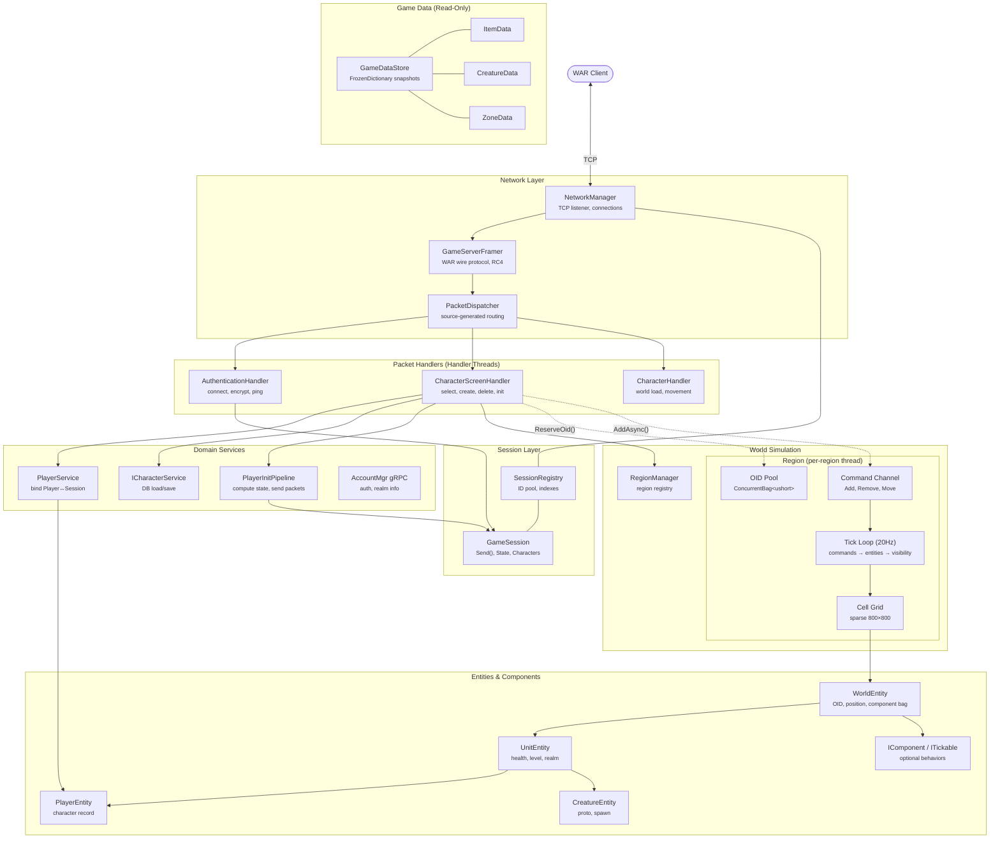

# WorldServerV2 — Architecture Overview

> **Purpose**: Entry point for the WorldServerV2 architecture documentation suite.
> This document covers project context, current state, high-level design, and the
> redesign roadmap. Deep dives live in the linked system documents.
>
> **Last updated**: March 2026

---

## Document Suite

| Document | Contents |
|----------|---------|
| **This file** | Project rationale, old architecture, current state, high-level design, roadmap |
| [Glossary](./Glossary.md) | All WAR-specific and server-internal terms |
| [System 1: Game Data Pipeline](./System_01_GameData.md) | Static game data loading, IGameDataStore, FrozenDictionary providers |
| [System 2: Entity Model](./System_02_EntityModel.md) | Entity/component hierarchy, WorldEntity, UnitEntity, PlayerEntity |
| [System 3: World Topology](./System_03_WorldTopology.md) | Regions, cells, visibility sets, 20Hz tick loop |
| [Player Login Flow](./Player_Login_Flow.md) | Init pipeline, protocol handshake, packet sequence, threading model |
| [System 4: Combat & Ability Engine](./System_04_Combat.md) | Stats, damage pipeline, buffs, abilities, career resources |
| [System 13: NPC & Static Object Spawning](./System_13_Spawning.md) | Creature/GO lifecycle, EntityFactory, RespawnScheduler, create-packet DTOs |
| [Architecture Guardrails](./Architecture_Guardrails.md) | Solution structure, threading rules, data flow patterns, project split, anti-patterns |

---

## Table of Contents

1. [Why a Separate Project](#1-why-a-separate-project)
2. [Old WorldServer — Architecture Summary](#2-old-worldserver--architecture-summary)
3. [WorldServerV2 — Current State](#3-worldserverv2--current-state)
4. [High-Level Architecture Overview](#4-high-level-architecture-overview)
5. [Redesign Roadmap](#5-redesign-roadmap)
6. [System 5: AI / Brain System](#6-system-5-ai--brain-system) *(stub)*
7. [System 6: Character Persistence](#7-system-6-character-persistence) *(stub)*
8. [System 7: Group & Warband](#8-system-7-group--warband) *(stub)*
9. [System 8: Guild](#9-system-8-guild) *(stub)*
10. [System 9: RvR / Campaign](#10-system-9-rvr--campaign) *(stub)*
11. [System 10: Quests](#11-system-10-quests) *(stub)*
12. [System 11: Scenarios](#12-system-11-scenarios) *(stub)*
13. [System 12: Economy (AH, Mail, Trade)](#13-system-12-economy-ah-mail-trade) *(stub)*
14. [Cross-Cutting Design Principles](#14-cross-cutting-design-principles)
15. [Shared Infrastructure Projects](#15-shared-infrastructure-projects)

---

## 1. Why a Separate Project

The old `WorldServer` project is ~120K lines across 501 files with deeply
inter-dependent static state, no DI, and no tests. Attempting to refactor in-place
would require touching hundreds of files per change, with no safety net.

`WorldServerV2` is a standalone executable that:

- **Shares** the infrastructure crates (`Core.Infrastructure.Network`,
  `Core.Infrastructure.Cryptography`, `Core.Infrastructure.Network.RpcSourceGenerators`,
  `Core.Entities`, `Core.Accounts`, `Common`)
- Re-implements game systems from scratch with clean architecture
- Can be verified against the old server for behavioral parity (integration tests
  send identical packets and compare responses)
- Allows breaking changes to domain types without destabilising the running old server

---

## 2. Old WorldServer — Architecture Summary

### 2.1 Project Stats

| Metric | Value |
|--------|-------|
| Total .cs files | 501 |
| Total lines | ~119,596 |
| Largest file | `BaseCommands.cs` — 4,194 lines |
| God classes (>1K lines) | Player (6,837), BuffInterface (3,859), Guild (3,145), ItemsInterface (2,704), CombatManager (2,376), BattleFrontKeep (2,103), Group (2,043), ScenarioMgr (1,961), WorldMgr (1,681), CharMgr (1,692), CommandMgr (1,714) |

### 2.2 Game Object Hierarchy

```
Point3D (FrameWork)
 └── Object (826 lines) — base world entity with OID, position, cell membership
       └── Unit (1,545 lines) — health, stats, combat state, 9 interfaces
             ├── Player (6,837 lines) — 14 additional interfaces, 23 total
             ├── Creature (1,463 lines) → Pet, Standard, Boss, KeepCreature, ...
             ├── GameObject (793 lines) → LootChest, GoldChest, KeepGameObject
             └── PublicQuest (1,015 lines)
       └── BattleFrontObjective → BattleFrontKeep (2,103 lines)
       └── BattlefieldObjective, ChapterObject, HotSpot, RvRStructure, Siege
```

Each `Unit` has up to 23 `BaseInterface` components (`CombatInterface`,
`BuffInterface`, `ItemsInterface`, `AbilityInterface`, etc.) registered in a `List<BaseInterface>`
and **all ticked every frame** — even idle players.

### 2.3 World Topology

| Layer | Class | State |
|-------|-------|-------|
| World | `WorldMgr` (static, 1,681 lines) | `_Regions` list, `_Keeps` dict, `LocalScripts`, `GlobalScripts`, 10+ other statics |
| Region | `RegionMgr` (923 lines) | Dedicated `Thread`, 50ms tick, `Objects[65000]` fixed array, `CellMgr[800,800]` grid |
| Zone | `ZoneMgr` (231 lines) | `List<Player>`, hotspot heatmap, PQuests |
| Cell | `CellMgr` (100 lines) | `List<Object>` (no lock), lazy-loaded spawns |

**Tick architecture**: Three independent timer-based threads:

| Thread | Interval | Responsibility |
|--------|----------|----------------|
| Region (1 per region) | 50ms | `AddNewObjects → RemoveOldObjects → UpdateActors → Campaign.Update` |
| World | 15s | Zone fight-level broadcast, heatmap decay |
| Group | 250ms | Process `_pendingGroupActions`, update groups/warbands |

### 2.4 Managers / Static Singletons

Nearly all state management lives in static classes:

| Manager | Lines | Key State |
|---------|-------|-----------|
| `WorldMgr` | 1,681 | `_Regions`, `_Keeps`, scripts, scenarios, campaigns |
| `CharMgr` | 1,692 | 13 static dictionaries (character templates, items, names, stats) |
| `CommandMgr` | 1,714 | All slash commands, social/guild commands inline |
| `AbilityMgr` | 692 | 11 static dictionaries (abilities, buffs, modifiers, knockbacks) |
| `LootsMgr` | 660 | Loot generation |
| `ScenarioMgr` | 1,961 | Queue management for matchmaking |
| `InstanceMgr` | 734 | Instance dungeon management |

### 2.5 Data Loading Pipeline (Old)

27 static `*Service` classes discovered via reflection (`[Service(...)]` + `[LoadingFunction]`):

```
AnnounceService, BagService, BattlefrontService, BountyService, CellSpawnService,
ChapterService, CreatureService, DyeService, GameObjectService, GuildService,
HonorService, InstanceService, ItemService, LiveEventService, MailService,
PQuestService, QuestService, RallyPointService, RewardService,
RVRProgressionService, RVRZoneRewardService, ScenarioService, TokService,
VendorService, WaypointService, XpRenownService, ZoneService
```

All follow the same pattern:
```csharp
public static class ItemService {
    public static Dictionary<uint, Item_Info> _Item_Info;
    [LoadingFunction(true)]
    public static void LoadItem_Info() {
        _Item_Info = Database.SelectAllObjects<Item_Info>()...;
    }
}
```

Cross-linking happens in `WorldMgr.LoadRelation()` — a single 400+ line method.

### 2.6 Combat & Abilities

| File | Lines | Role |
|------|-------|------|
| `CombatManager.cs` | 2,376 | Static class — all damage formula math |
| `AbilityProcessor.cs` | 978 | Ability execution pipeline |
| `AbilityInterface.cs` | 1,338 | Per-unit ability state (cooldowns, casting) |
| `BuffInterface.cs` | 3,859 | Per-unit buff management (god class) |
| `AbilityEffectInvoker.cs` | 558 | Effect dispatch via reflection |
| `AbilityModifierInvoker.cs` | 943 | Modifier dispatch via reflection |

17 career-specific `CareerInterface_*.cs` files.

### 2.7 Social Systems

| System | Key File | Lines | Issues |
|--------|---------|-------|--------|
| Groups | `Group.cs` | 2,043 | Static `WorldGroups` list + `_pendingGroupActions` queue |
| Warbands | `WarbandHandler.cs` | 760 | 4 Groups glued together, `ReaderWriterLockSlim` |
| Guilds | `Guild.cs` | 3,145 | Monolithic: ranks, permissions, tax, vaults, heraldry, alliances |

### 2.8 RvR / Campaign

`Campaign.cs` (1,474 lines) — per-region, tightly coupled to `WorldMgr` statics.
`BattleFrontKeep.cs` (2,103 lines) — both world entity and strategic state machine.
**Bright spot**: The Bounty subsystem (`BountyManager`, `ContributionManager`,
`ImpactMatrixManager`, `RewardManager`) uses proper interfaces — best-structured code.

### 2.9 Thread Safety (Old)

| Pattern | Where Used |
|---------|------------|
| Dedicated `Thread` | 1 per region, 1 for groups, 1 for world updates |
| `lock()` | `Player._Players`, `Group.WorldGroups`, `AuctionHouse.Auctions`, object add/remove |
| `ReaderWriterLockSlim` | `WorldMgr.RegionsRWLock`, `WarbandHandler._membersRWLock` |
| `ConcurrentDictionary` | `CharMgr.CharacterStartingItems`, `Campaign.OrderPlayerPopulationList` |
| **No synchronization** | Most `CellMgr` lists, many `CharMgr` dicts, all `AbilityMgr` dicts |

---

## 3. WorldServerV2 — Current State

### 3.1 Project Structure (as of March 2026)

```
src/WorldServerV2/
├── Program.cs                          — Stub (Hello World)
├── WorldServerV2.csproj                — net10.0, refs: Common, Crypto, Network, RpcGen, gRPC
├── Data/
│   ├── IGameDataStore.cs              — Read-only facade over all static game data
│   ├── GameDataStore.cs               — Concrete impl with immutable Snapshot + atomic swap
│   ├── IDataProvider.cs               — Generic provider contract (IDataProvider<TData>)
│   ├── GameDataLoader.cs              — IHostedService that orchestrates loading at startup
│   ├── GameDataServiceExtensions.cs   — AddGameData() DI registration
│   ├── Domain/
│   │   ├── ItemData.cs                — FrozenDictionary<uint, Item_Info>
│   │   ├── CreatureData.cs            — FrozenDictionary<uint, Creature_proto> + Spawns
│   │   └── ZoneData.cs               — FrozenDictionary<ushort, Zone_Info> + Jumps
│   └── Providers/
│       ├── ItemDataProvider.cs        — Loads items from IObjectDatabase
│       ├── CreatureDataProvider.cs    — Loads creatures + cross-links Spawn.Proto
│       └── ZoneDataProvider.cs        — Loads zones, filters disabled jumps
├── Network/
│   ├── ClientState.cs                  — enum: NotConnected → WorldEnter → Playing → Disconnected
│   ├── GameClientConnectionContext.cs  — Extension members on IConnectionContext (Session, Account, ClientId)
│   ├── GameServerContext.cs            — [PacketSerializerContext] for source-generated serializer
│   ├── GameServerFramer.cs             — IPacketFramer: WAR wire protocol (RC4, checksum)
│   ├── GameServerSerializer.cs         — Manual binary serializer (EncryptKey only)
│   ├── GameSession.cs                  — Session mediator (ushort Id, Send<T>, Disconnect)
│   ├── GameSessionServiceExtensions.cs — AddGameSessions() DI registration
│   ├── Opcodes.cs                      — Full opcode enum (0x00–0xFF)
│   ├── SessionLifecycleService.cs      — IHostedService: wires NetworkManager events → SessionRegistry
│   ├── SessionRegistry.cs             — Singleton: Stack<ushort> ID pool, ConcurrentDictionary indexes
│   ├── SpanExtensions.cs              — Fletcher-like checksum
│   ├── Handlers/
│   │   └── AuthenticationHandler.cs   — F_ENCRYPTKEY, F_CONNECT, F_PING, F_DISCONNECT, F_PLAYER_ENTER_FULL, F_PLAYER_EXIT, F_REQUEST_CHAR
│   └── Dtos/
│       ├── ConnectRequest.cs / ConnectResponse.cs
│       ├── EncryptKeyRequest.cs / EncryptKeyResponse.cs
│       ├── PingRequest.cs / PingResponse.cs
│       ├── PlayerEnterRequest.cs / PlayerEnterResponse.cs
│       ├── PlayerExitRequest.cs / PlayerQuitResponse.cs
│       └── RequestCharacterRequest.cs / RequestCharacterResponse.cs / RequestCharacterErrorResponse.cs
├── Services/
│   ├── ICharacterService.cs           — Interface: LoadCharactersForAccount, GetAccountRealm
│   └── PlayerService.cs              — Bind/Unbind PlayerEntity↔Session, ConcurrentDictionary indexes
└── World/
    ├── Components/
    │   ├── IComponent.cs              — Optional behaviour contract + ComponentBase convenience class
    │   ├── ITickable.cs               — Opt-in tick interface for optional components
    │   └── HealthComponent.cs         — HP pool (standalone class, direct field on UnitEntity)
    └── Entities/
        ├── EntityType.cs              — enum: Player, Creature, Pet, GameObject, Siege, PublicQuest, Keep
        ├── WorldEntity.cs             — Abstract base: ObjectId, Name, Position, optional component bag
        ├── WorldPosition.cs           — readonly record struct: X, Y, Z, Heading, ZoneId
        ├── UnitEntity.cs              — Abstract: Health (direct), Level, Realm, Faction
        ├── PlayerEntity.cs            — Sealed: Character record, CharacterId, DisconnectType
        ├── CreatureEntity.cs          — Sealed: Proto, Spawn, Entry
        ├── PetEntity.cs               — Sealed: Proto, Spawn, Owner
        ├── GameObjectEntity.cs        — Sealed: Entry, VfxState, Interactable
        └── DisconnectType.cs          — enum: Unclean, Clean, Crash
```

### 3.2 Key Design Decisions Already Made

| Decision | Rationale |
|----------|-----------|
| `GameSession` hides `IConnectionContext` — game code only sees `Send<T>()` + `Disconnect()` | Law of Demeter; prevents game code from depending on transport internals |
| Session IDs are `ushort` (1–65535) with a recycling `Stack<ushort>` pool | Protocol requires uint16 SessionID; pool gives O(1) alloc/free with no wraparound bugs |
| `SessionRegistry` + `PlayerService` are singletons with `Lock`-serialized writes, lock-free reads | Writes are rare (connect/disconnect); reads happen every packet and every tick |
| `ICharacterService` interface rather than static `CharMgr` | Enables DI, testability, separation of data access from business logic |
| `AuthenticationHandler` injects `AccountMgr.AccountMgrClient` (gRPC) directly | No more coupling to static `Core.AcctMgr`; testable with gRPC mocks |
| Player does NOT live on GameSession | Lifecycle mismatch (session outlives individual characters); `PlayerService` maps between them |
| `RealmInfo` is an injected value object, not `Core.Rm` static | Clean DI, no hidden global state |

### 3.3 Dependencies

```
WorldServerV2 → Common                         (shared entities: Character, Item_Info, etc.)
              → Core.Infrastructure.Network     (NetworkManager, ClientConnection, IConnectionContext, IPacketFramer, etc.)
              → Core.Infrastructure.Cryptography (MythicRc4)
              → Core.Infrastructure.Network.RpcSourceGenerators (source generator for [Rpc] dispatch)
              → Grpc.Net.Client                 (AccountMgr gRPC client)
              → Npgsql.EntityFrameworkCore.PostgreSQL (EF Core 10, WorldDbContext)
```

### 3.4 Integration Tests (in `test/WorldServer.Tests/`)

Currently targets the old WorldServer project. The test infrastructure is designed to
be reusable for WorldServerV2:

| File | Purpose |
|------|---------|
| `Integration/GameServerTestHarness.cs` | Boots real `NetworkManager` on ephemeral port with full DI |
| `Integration/GameClientSimulator.cs` | Raw `TcpClient` that speaks WAR wire protocol |
| `Integration/TestPacketDispatcher.cs` | Minimal `IPacketDispatcher` for test (F_ENCRYPTKEY + F_DISCONNECT) |
| `Integration/NetworkSmokeSuite.cs` | 9 tests: connect/disconnect lifecycle, encrypt handshake, concurrency |

---

## 4. High-Level Architecture Overview

### 4.1 Architecture Diagram



### 4.2 Component Responsibilities

| Component | Type | Responsibility |
|-----------|------|----------------|
| **NetworkManager** | Infrastructure | Accepts TCP connections, manages connection lifecycle, dispatches raw bytes to the framer/serializer pipeline. |
| **GameServerFramer** | Infrastructure | Implements the WAR wire protocol — packet framing (`[u16 size][u8 opcode][payload]`), RC4 encryption/decryption, checksum validation. |
| **PacketDispatcher** | Infrastructure (generated) | Source-generated routing table that maps inbound opcodes to `[Rpc]`-attributed handler methods. Deserializes request DTOs, invokes the handler, serializes response DTOs. |
| **SessionRegistry** | Singleton | Manages the pool of `ushort` session IDs and indexes active sessions. O(1) alloc/free via `Stack<ushort>`. |
| **GameSession** | Per-connection | Mediator between network transport and game logic. Exposes `Send<T>()` (thread-safe, channel-backed), holds `ClientState`, character list, and account reference. Game code never touches raw `IConnectionContext`. |
| **Packet Handlers** | Scoped (per-request) | Stateless request handlers annotated with `[Rpc(in, out)]`. Receive deserialized DTOs, inject services via `[FromServices]`, return response DTOs. All game-triggered I/O and orchestration lives here. |
| **PlayerService** | Singleton | Bidirectional `PlayerEntity` ↔ `GameSession` binding. `ConcurrentDictionary` indexes for O(1) lookup by session or character ID. |
| **ICharacterService** | Singleton (interface) | Character CRUD and DB loading. Async methods for loading the full character graph (character + value + items + future systems). |
| **PlayerInitPipeline** | Singleton | Orchestrates the login packet sequence (Phase B compute + Phase C serialize). Runs on the handler thread while the client is on a loading screen. Evolves into thin service-call orchestration as domain services are built. |
| **GameDataStore** | Singleton | Immutable snapshot of all static game data (`FrozenDictionary` collections). Loaded at startup by `GameDataLoader`. Provides `.Items`, `.Creatures`, `.Zones`, etc. |
| **RegionManager** | Singleton | Registry of `Region` instances. `GetOrCreate(ushort)` for lazy creation. |
| **Region** | Per-region (owns thread) | Spatial container: sparse cell grid, OID pool, command channel, 20Hz tick loop. Processes add/remove/move commands, ticks active entities, updates visibility. Single-threaded — all mutation happens on the region thread. |
| **Cell** | Per-cell (within Region) | Fixed-size spatial bucket (4096×4096 game units). Holds entity lists. Lazy-allocated on first player proximity. Tracks active (has players) and loaded (spawns materialized) state. |
| **VisibilitySet** | Per-entity | `HashSet`-backed range cache tracking which entities are visible to this entity. `internal` write access (region thread only), public read. Separate `Players` set avoids type checks on the packet dispatch hot path. |
| **WorldEntity** | Abstract base | Identity (OID, name), position (`WorldPosition`), optional `IComponent` bag. `Update(tick)` iterates only `ITickable` components. |
| **UnitEntity** | Abstract (extends WorldEntity) | Combat-capable entity. Direct fields: `HealthComponent`, `Level`, `Realm`, `Faction`. |
| **PlayerEntity** | Sealed leaf | Human-controlled unit. Holds the DB `Character` record, `CharacterId`, `DisconnectType`. Thin data holder — logic lives in services. |
| **CreatureEntity** | Sealed leaf | NPC mob. Holds `CreatureProto` (template), `CreatureSpawn` (instance), `Entry`. |
| **IComponent / ITickable** | Interface | Optional behaviors attached to entities at runtime. `ComponentBase` manages the `Owner` back-reference. `ITickable` components are ticked each frame; non-tickable components are passive state holders. |
| **HealthComponent** | Direct field on UnitEntity | HP pool: `Current`, `Max`, `TakeDamage()`, `Heal()`, `Resurrect()`. Not in the optional component bag — required for all units. |
| **RealmInfo** | Value object (injected) | Server identity: realm ID, name. Replaces the old static `Core.Rm`. |

### 4.3 Data Flow Summary

| Flow | Path | Threading |
|------|------|-----------|
| **Inbound packet** | Client → TCP → `GameServerFramer` (decrypt + deframe) → `PacketDispatcher` (route) → Handler method | Network I/O thread → handler thread pool |
| **Outbound packet** | Handler/Service calls `session.Send<T>()` → channel enqueue → `GameServerFramer` (serialize + encrypt) → TCP | Any thread → network I/O thread |
| **Entity mutation (gameplay)** | Handler enqueues `RegionCommand` → Region tick drains command → mutates entity on region thread | Handler thread → region thread (via Channel) |
| **Entity tick** | Region tick loop → active cells → `entity.Update(tick)` → `ITickable` components | Region thread only |
| **Visibility update** | Entity moves > 100 units → region re-scans 3×3 cell neighborhood → bidirectional add/remove on `VisibilitySet` | Region thread only |
| **Player login** | Handler thread: load DB → compute state → send packets → `AddAsync()` → region places entity → handler sends INIT_COMPLETE | Handler thread + one region-thread command |

---

## 5. Redesign Roadmap

Ordered by dependency — foundational systems first, each unblocking the next tier.

```
Phase 1 (Foundation):
  [1] Game Data Pipeline       ✅ Complete  → System_01_GameData.md
  [2] Game Object Model        ✅ Complete  → System_02_EntityModel.md
  [3] World Topology & Tick    ✅ Complete  → System_03_WorldTopology.md

Phase 1.5 (Player Login — unblocks Phase 2 testing):
  [→] Player Initialization    ✅ Complete  → Player_Login_Flow.md

Phase 2 (Core Gameplay):
  [4] Combat & Abilities       📐 Design complete, implementation not started  → System_04_Combat.md
  [5] AI / Brain System        🔲 Not started
  [6] Character Persistence    🔲 Not started

Phase 2.5 (Spawning — enables NPC/GO presence):
  [13] NPC & Static Spawning   📐 Design complete, implementation not started  → System_13_Spawning.md

Phase 3 (Social & Competitive):
  [7] Group & Warband          🔲 Not started
  [8] Guild                    🔲 Not started
  [9] RvR / Campaign           🔲 Not started

Phase 4 (Supporting):
  [10] Quests                  🔲 Not started
  [11] Scenarios               🔲 Not started
  [12] Economy (AH/Mail/Trade) 🔲 Not started
```

---

## 6. System 5: AI / Brain System

**Problem**: `ABrain` (949 lines) with 23 subclasses mixing decision and action.

**New design direction**: Behavior-tree-first design (BehaviourTree NuGet already
available). Reusable BT node library. Data-driven brain assignment per creature template.

**Status**: Not started.

---

## 7. System 6: Character Persistence

**Problem**: `CharMgr` (1,692 lines, 13 static dicts) mixes caching, DB queries,
and business logic with inconsistent locking.

**New design direction**: `ICharacterRepository` (data), `CharacterCache` (read-through,
injectable), `CharacterService` (business logic). Explicit load-on-login via
`SessionLifecycleService`.

**Status**: `ICharacterService` interface exists with `LoadCharactersForAccount` and
`GetAccountRealm`. No implementation yet.

---

## 8. System 7: Group & Warband

**Problem**: `Group.cs` (2,043 lines) handles loot, XP, UI packets, warband promotion.
Static `WorldGroups` + `_pendingGroupActions`.

**New design direction**: `GroupService` singleton with `ConcurrentDictionary`. Group is
membership state only. Loot, XP sharing, and packet writing decomposed into focused services.

**Status**: Not started.

---

## 9. System 8: Guild

**Problem**: `Guild.cs` (3,145 lines) — monolithic.

**New design direction**: `GuildService` + focused value objects (`GuildRoster`,
`GuildVault`, `GuildHeraldry`, `GuildAlliance`). Injectable `GuildRegistry`.

**Status**: Not started.

---

## 10. System 9: RvR / Campaign

**Problem**: `Campaign.cs` (1,474 lines) tightly coupled to `WorldMgr` statics.
`BattleFrontKeep.cs` (2,103 lines) is both world entity and state machine.

**New design direction**: `ICampaign` interface resolved per-region. Separate world
entity from strategic state machine. Use Bounty subsystem design as template.

**Status**: Not started.

---

## 11. System 10: Quests

**Problem**: Quest loading split across `WorldMgr`, `QuestService`, `QuestsInterface`.
`GenerateObjective()` has 10+ inline branches.

**New design direction**: `QuestDataStore` (in game data pipeline) + `QuestTracker`
component + `QuestEngine` service with `IQuestObjectiveEvaluator` strategy.

**Status**: Not started.

---

## 12. System 11: Scenarios

**Problem**: `ScenarioMgr.cs` (1,961 lines) — massive singleton.

**New design direction**: `ScenarioMatchmaker` + `ScenarioInstance` + `ScenarioFactory`.
Lightweight instanced regions.

**Status**: Not started.

---

## 13. System 12: Economy (AH, Mail, Trade)

**Problem**: `static List<Auction>` with `lock` and O(n) scans. Mail delivery via
`CharMgr.AddMail()`.

**New design direction**: `AuctionService` with indexed collections. `MailService` with
explicit send/receive pipeline.

**Status**: Not started.

---

## 14. Cross-Cutting Design Principles

These apply to every system in the redesign:

1. **Dependency Injection everywhere** — no static state, no service locators
2. **Immutable data, mutable state** — game data loaded once, frozen. Runtime state
   in clearly owned, synchronized containers.
3. **Interface-first for testability** — every system boundary is an interface that
   can be faked in integration tests
4. **Thread-safety by design** —
   - Immutable/frozen collections for read-only data (zero locks)
   - `ConcurrentDictionary` + `Lock` for registries (lock-free reads, serialized writes)
   - `Channel<T>` for producer-consumer queues (replaces manual lock + List patterns)
   - Region thread isolation for tick-scoped state
5. **Composition over inheritance** — flat entity model with opt-in components
6. **Small, focused classes** — target under 500 lines per file; split god classes
   into focused services
7. **Verify against the old server** — integration tests send identical packets to
   both old and new servers, comparing responses byte-for-byte where possible

---

## 15. Shared Infrastructure Projects

These projects are shared between old and new servers, already stable:

| Project | Purpose | Key Types |
|---------|---------|-----------|
| `Core.Infrastructure.Network` | TCP server, connection management, DI-scoped handlers | `NetworkManager`, `ClientConnection`, `IConnectionContext`, `IPacketFramer`, `IPacketSerializer`, `IPacketDispatcher` |
| `Core.Infrastructure.Network.RpcSourceGenerators` | Compile-time codegen for `[Rpc]`-attributed handlers | Generates `DefaultPacketDispatcher`, serializer switch |
| `Core.Infrastructure.Cryptography` | RC4 encryption | `MythicRc4` |
| `Core.Entities` | EF Core entity definitions | `Account` |
| `Core.Accounts` | Account service logic | `AccountService` |
| `Common` | Shared DB entities from old codebase | `Character`, `Item_Info`, etc. |
