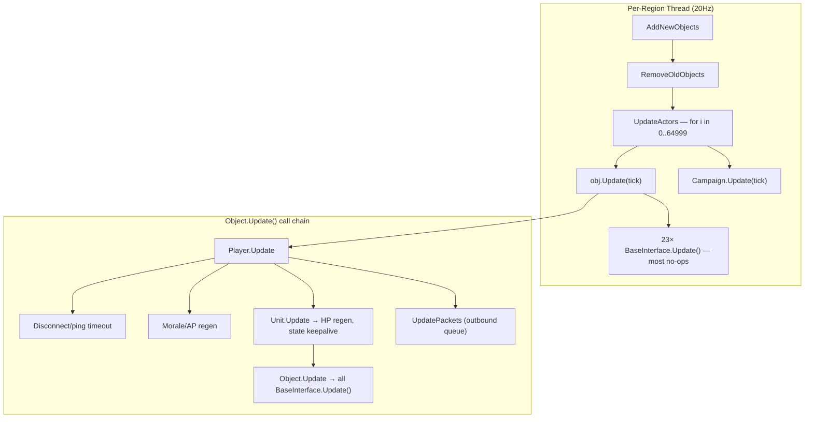
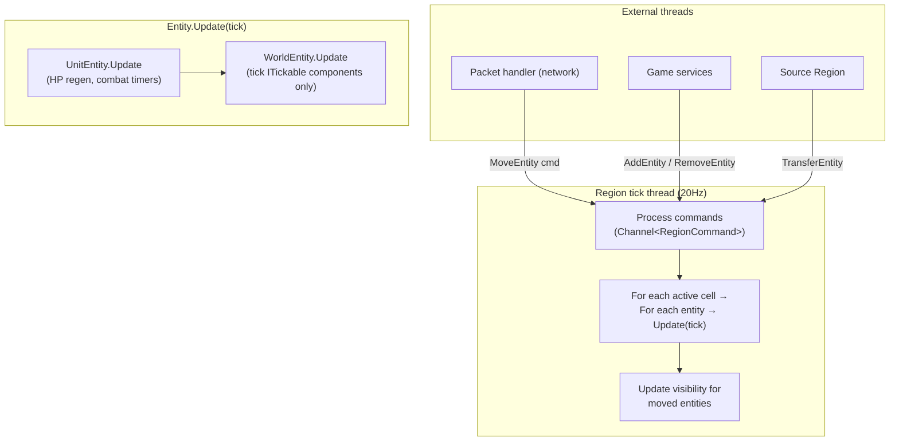
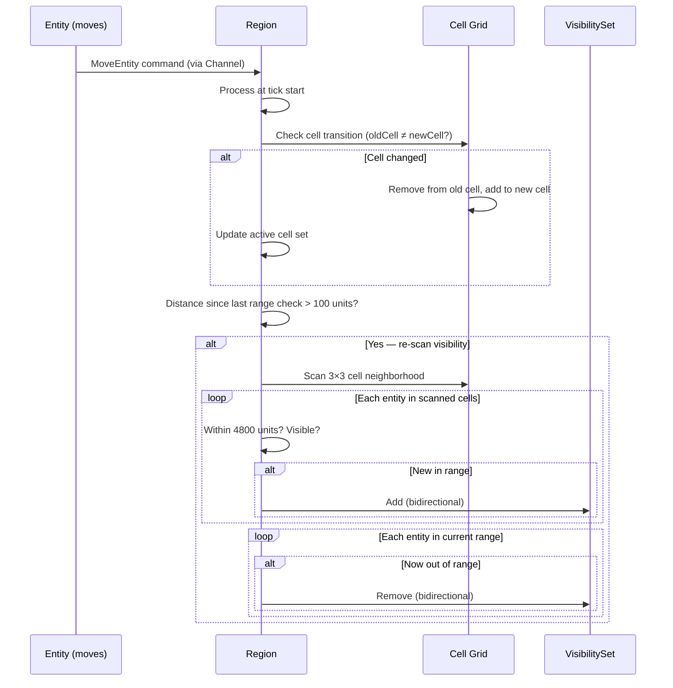

# System 3: World Topology & Update Loop

> Part of the [WorldServerV2 Architecture](./Overview.md) documentation suite.
> See also: [Glossary](./Glossary.md) · [System 2: Entity Model](./System_02_EntityModel.md) · [System 13: NPC Spawning](./System_13_Spawning.md)
>
> **Status**: ✅ Complete — Region, Cell, VisibilitySet, RegionManager, RegionCommand, WorldPosition all implemented with tests.
>
> **Last updated**: April 2026

---

**Problem**: One `Thread` per region iterates a fixed 65K array. `Thread.Sleep()` for
timing. No parallelism within a region. `CellMgr.Objects` has no synchronization.

---

## Old Architecture (Detailed)



| Layer | Old Type | State | Threading |
|-------|----------|-------|-----------|
| Region | `RegionMgr` (923 lines) | `Object[65000]` fixed array, `CellMgr[800,800]` sparse grid | 1 dedicated `Thread` per region, `Thread.Sleep(50ms)` |
| Cell | `CellMgr` (92 lines) | `List<Object>`, `List<Player>`, no locks | Lazy-loaded on first player proximity |
| Zone | `ZoneMgr` (231 lines) | `List<Player>`, `int[64,64]` heatmap | Zone transitions within region via offset math |
| Object | `Object.ObjectsInRange` / `PlayersInRange` | Publicly mutable `List<>`, bidirectional | Updated when entity moves >100 units |
| OID | Linear scan of 65K array for next null slot | `Objects[oid] = entity` for O(1) lookup | `Interlocked.Exchange` for cross-thread OID hand-off |

**Key constants (preserved from old code):**

| Constant | Value | Meaning |
|----------|-------|---------|
| Cell size | 4096 game units | ~341 feet (12 units/ft) |
| Max visibility | 4800 units (400 ft) | Range list cutoff |
| Range update threshold | 100 units (~8.3 ft) | Movement before re-scanning |
| Cell scan radius | 1 cell (3×3 neighborhood) | 9 cells scanned for visibility |
| Region tick | 50 ms (20 Hz) | Target frame time |
| Max cell index | 800×800 | Sparse grid bounds |

---

## New Design



| Concern | Old | New |
|---------|-----|-----|
| Coordinates | Zone-local `X,Y,Z` + separate `WorldPosition` point | Region-wide `X,Y` on `WorldPosition` — zone-local derived at network boundary |
| Cell grid | `CellMgr[800,800]` fixed, all iterated | `Cell?[800,800]` sparse, only **active** cells iterated via `HashSet<Cell>` |
| Object storage | `Object[65000]` flat array (linear scan) | Per-cell `List<WorldEntity>` for tick, `Dictionary<ushort, WorldEntity>` for OID lookup |
| OID assignment | Linear scan for next null | `Stack<ushort>` recycling pool — O(1) alloc/free |
| Add/Remove | `lock(List<>)` queues drained per tick | `Channel<RegionCommand>` — lock-free, drained at tick start |
| Tick iteration | 65K null checks + all interfaces ticked | Active cells only → entities with `ITickable` components only |
| Visibility cache | Publicly mutable `List<Object>` on entity | `VisibilitySet` — `HashSet`-backed, `internal` write, public read |
| Per-tick cost per player | ~23 `BaseInterface.Update()` calls (most no-ops) | Only attached `ITickable` components ticked |
| Region transfer | Remove from array + re-add with new OID (unsafe) | `Channel<RegionCommand>` — thread-safe cross-region hand-off |
| World-level updates | Separate raw `Thread` with `Thread.Sleep(15s)` | `IHostedService` with `PeriodicTimer` (heatmap, fight levels) |

---

## Key Design Decisions

| Decision | Rationale |
|----------|-----------|
| Region-wide coordinates as primary representation | Distance checks are the hottest path (spatial queries, combat, packet dispatch). Storing region-wide avoids per-check ZoneInfo lookup. Zone-local derived only at network boundary (one multiply + add per packet). |
| `Dictionary<ushort, WorldEntity>` for OID lookup | O(1) by hash vs. O(1) by index — dictionary trades ~2ns for significant memory savings with typical populations of 50–500 entities per region. |
| `Stack<ushort>` OID pool | Identical pattern to `SessionRegistry`. O(1) alloc/free, no linear scan, no wraparound bugs. |
| Per-cell entity lists + active cell set | Tick cost is proportional to live entities, not grid size. Empty regions cost zero. A 200-player PvP battle ticks exactly the cells that have entities. |
| `VisibilitySet` with `internal` mutators | Fixes the old code's thread-safety bug where any code could mutate range lists. Only the region's tick thread writes visibility; game code reads. `HashSet` gives O(1) add/remove/contains. Separate `Players` set avoids `is Player` type checks on the packet dispatch hot path. |
| Single-threaded per region (no intra-region parallelism) | Entity interaction during a tick (AI reads health, combat writes buffs) creates data races under parallelism. Lock-per-entity or deferred buffers kill the benefit. The old server ran 13 active regions on one box at 20Hz — single-threaded is sufficient. Optimize later with profiling data. |
| `Channel<RegionCommand>` for all cross-thread operations | Unifies add/remove/transfer/move into one thread-safe queue. Lock-free `Channel` is purpose-built for this. Commands processed at tick start, before entity updates — deterministic ordering. |
| Lazy cell loading triggered by player proximity | Don't spawn 100K creatures at startup. Load 3×3 neighborhood when a player enters a cell. NPCs in unvisited cells never allocate. Spawn data indexed by `(regionId, cellX, cellY)` in `GameDataStore`. |

---

## Spatial Query Flow



---

## Type Structure

```
src/WorldServerV2/World/
├── Spatial/
│   ├── Cell.cs                     — Per-cell entity lists, loaded/active tracking
│   ├── Region.cs                   — Cell grid, OID pool, tick loop, visibility, commands
│   ├── RegionCommand.cs            — Discriminated command types for the Channel
│   ├── RegionConstants.cs          — CellSize, MaxVisibility, tick interval, etc.
│   ├── RegionManager.cs            — Singleton registry: create/lookup regions
│   └── VisibilitySet.cs            — HashSet-backed per-entity range cache
├── Components/
│   ├── IComponent.cs               — Optional behaviour contract + ComponentBase
│   ├── ITickable.cs                — Opt-in tick interface
│   └── HealthComponent.cs          — HP pool (direct field on UnitEntity)
└── Entities/
    ├── WorldEntity.cs              — Abstract base + VisibilitySet field
    ├── WorldPosition.cs            — Region-wide coords + ZoneId + factory methods
    ├── UnitEntity.cs               — Health, Level, Realm, Faction
    ├── PlayerEntity.cs             — Character record, DisconnectType
    ├── CreatureEntity.cs           — Proto, Spawn, Entry
    ├── PetEntity.cs                — Proto, Spawn, Owner
    ├── GameObjectEntity.cs         — Entry, VfxState, Interactable
    ├── EntityType.cs               — Discriminator enum
    └── DisconnectType.cs           — Disconnect reason enum
```
