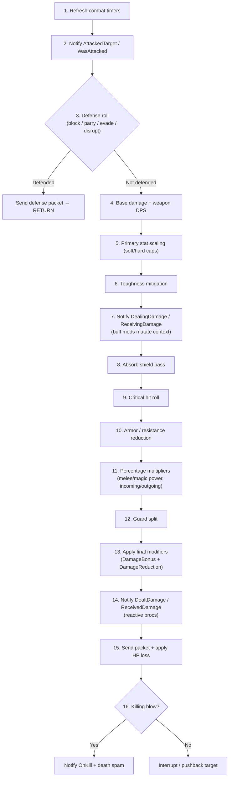

# System 4: Combat & Ability Engine

> Part of the [WorldServerV2 Architecture](./Overview.md) suite.
> Related: [Glossary](./Glossary.md) · [System 2: Entity Model](./System_02_EntityModel.md) · [Player Login Flow](./Player_Login_Flow.md)

**Problem**: The V1 combat stack spans ~15,000 lines across ~40 files with pervasive
god classes, string-based dispatch, duplicated formulas, and no thread safety between
the handler and region threads.

| V1 Subsystem | Key Types | Lines | Core Issue |
|---|---|---|---|
| Stats | `StatsInterface` (per-unit) | ~800 | 5-layer modifier system; well-structured internally but mutation from any thread with no synchronization |
| Abilities | `AbilityMgr` (static), `AbilityInterface` (per-unit), `AbilityProcessor` (per-unit) | ~3,000 | `StartCast()` on handler thread shares mutable state with `Update()` on region thread — no locks |
| Effects | `AbilityEffectInvoker`, `AbilityModifierInvoker` | ~1,500 | ~110 string-keyed delegates; no compile-time safety; typos in DB data silently fail |
| Buffs | `BuffInterface` (per-unit), `BuffEffectInvoker` (static), `NewBuff` + 9 subclasses | ~10,000 | 4,871-line god class; hand-rolled double-buffer with `ReaderWriterLockSlim`; duplicated lifecycle boilerplate |
| Combat Math | `CombatManager` (static) | ~2,400 | 21-step damage pipeline copy-pasted across 5 separate paths with inline micro-variations |
| Careers | `CareerInterface` + 15 subclasses | ~3,000 | Heterogeneous resource mechanics tightly coupled to stats and abilities |

**Status**: Design complete. Implementation not started.

---

## 11.1 V1 Architecture — Key Observations

**The dependency cycle**: Buffs modify stats → stats feed ability validation and combat
math → abilities create buffs → combat events trigger buff procs which invoke more
effects. Any V2 design must model this dependency graph explicitly.

**The damage formula is consistent but duplicated**: All 5 V1 damage paths
(`InflictDamage`, `InflictAutoAttackDamage`, `InflictOffhandDamage`, `InflictProcDamage`,
`InflictPrecalculatedDamage`) follow the same 21-step pipeline with small per-path
variations (procs skip weapon DPS, auto-attacks create their own damage info).
This is the strongest DRY violation.

**BuffCombatEvents are the reactive backbone**: 15 named event hooks fire at precise
points in the damage pipeline. Buffs subscribe to these events and can mutate in-flight
damage context (bonuses, reductions, absorption) or trigger secondary effects (proc
damage, proc heals, proc buffs).

**Ability cast has two thread-affinity phases**: Initiation (handler thread: target
acquisition, validation, cast-bar packet) and Execution (region thread tick: timer
countdown, range re-check, effect application). V1 doesn't synchronize between them.

**The stat modifier system is well-designed**: Five isolated layers with buff-class
priority stacking and sorted lists for highest-only semantics. Worth preserving the
concept; modernize the implementation.

---

## 11.2 Stats System

### Storage & Access

`StatContainer` wraps a fixed `StatEntry[109]` array indexed by `StatId` enum value.
~80% of call sites use compile-time enum constants (`StatId.Strength`), but runtime-
variable access is common in combat math (`(StatId)damageInfo.StatUsed`), creature
initialization (DB-driven loops), and resistance lookup (arithmetic on damage type).
Array indexing gives O(1) access with zero allocation — dictionary overhead (~30ns per
lookup) is unjustified for a 109-element set accessed 15+ times per damage resolution.

```
StatContainer (per UnitEntity)
├── StatEntry[109]              — one per StatId, fixed array
│   ├── BaseStat                — level-scaled value (from DB / level-up tables)
│   ├── RenownBonus             — from renown spec
│   ├── ItemBonus               — gear + talisman (with bolster scaling)
│   ├── BuffBonus               — additive bonuses from buffs (per BuffClass)
│   ├── BuffReduction           — additive debuffs from buffs (per BuffClass)
│   ├── BonusMultiplier         — percentage bonuses (per BuffClass)
│   └── ReductionMultiplier     — percentage reductions (per BuffClass)
├── IsDirty : bool              — set on any mutation, gates client notification
└── Flush()                     — recomputes derived stats, sends packet if dirty
```

### Modifier Layering

Preserves V1's 5-layer formula:

```
FinalStat = (BaseStat + RenownBonus + ItemBonus + BuffBonus − BuffReduction)
            × (BonusMultiplier × ReductionMultiplier)
```

- **Buff-class stacking**: Classes 0 and 1 use "highest only" semantics (adding a
  50-Str buff then a 70-Str buff yields 70, not 120). Classes 2+ (tactics, career
  mechanics) always stack additively. Preserved from V1 as a balance-tunable policy
  within `StatEntry`, not a structural assumption.
- **Item bonus isolation**: Separate layer allows bolster scaling and item-disable
  effects (e.g., stealth removing item stats) without affecting buff modifiers.

### Derived Stats & Dirty Flag

Stat mutations (any layer) set `IsDirty = true`. `Flush()` (called once per tick at
most) recomputes derived values:

- `MaxHealth = Wounds × 10` (clamps current HP if reduced)
- `MaxActionPoints` from base + stat modifiers
- Client `F_PLAYER_STATS` packet sent only if dirty

`GetTotal(StatId)` always returns the live computed value regardless of dirty state —
the dirty flag gates **client notification**, not internal reads.

### Key Types

| Type | Responsibility |
|------|---------------|
| `StatId` | Strongly-typed enum (replaces V1 `Stats`). Values 0–108. |
| `StatEntry` | Per-stat modifier state: base, item, buff layers, multipliers. Computes total. |
| `StatContainer` | Fixed `StatEntry[109]` array on `UnitEntity`. Dirty flag + `Flush()`. `AddBonus()`, `RemoveBonus()`, `AddMultiplier()`, `RemoveMultiplier()`, `GetTotal()`. |
| `BuffClass` | Enum identifying modifier source tier (Buff0, Buff1, Tactic, Career, etc.). Determines stacking policy. |

---

## 11.3 Damage Pipeline

### Unified Pipeline

V1's 5 duplicate damage paths become one `DamagePipeline.Resolve(DamageContext)`.
Variations are flags on the context, not separate code paths:

| V1 Path | V2 Flag |
|---------|---------|
| `InflictDamage` | Default |
| `InflictAutoAttackDamage` | `IsAutoAttack = true` (creates own context from weapon slot) |
| `InflictOffhandDamage` | `IsAutoAttack = true, IsOffhand = true` (90% penalty) |
| `InflictProcDamage` | `IsProc = true` (skips weapon DPS) |
| `InflictPrecalculatedDamage` | `IsPrecalculated = true` (skips scaling, applies fraction) |

### DamageContext

Replaces V1's mutable `AbilityDamageInfo` bag. Organized in clear sections:

```
DamageContext
├── Input (immutable after creation)
│   ├── AbilityEntry, DamageType, StatUsed, Level
│   ├── IsAutoAttack, IsOffhand, IsProc, IsPrecalculated, IsAoE
│   └── PreCastDefenseCheck : bool (flag for multi-effect defense — see §11.3.1)
├── Scaling (computed then frozen)
│   ├── BaseDamage, WeaponDps, StatContribution
│   └── ToughnessMitigation
├── Mitigation (computed then frozen)
│   ├── ArmorReduction, ResistanceReduction
│   └── WasBlocked, WasParried, WasEvaded, WasDisrupted
├── Modifiers (mutable during event processing)
│   ├── DamageBonus, DamageReduction (from buff events)
│   ├── Absorption (from absorb shields)
│   └── CritMultiplier
└── Result (written once at pipeline end)
    ├── FinalDamage, FinalMitigation, FinalAbsorption
    ├── WasCritical, WasDefended, WasKillingBlow
    └── GuardSplit (amount redirected to guard tank)
```

### Pipeline Stages



All stages live in a single `DamagePipeline` service. Each stage is a private method —
no need for a formal "stage" abstraction. The method reads from `DamageContext` sections
filled by earlier stages, writes to its own section.

### 11.3.1 Pre-Cast Defense Flag

Some abilities check defense once before applying multiple effects (e.g., a combo that
should be fully blocked or fully landed). Modeled as `DamageContext.Input.PreCastDefenseCheck`.
When set, `AbilityCastService` performs a single defense roll during `Cast()` before
iterating effects. If defended, all effects are skipped. This replaces V1's duplicated
`CheckDefense` pre-cast path.

### Heal Pipeline

Simpler variant: stat scaling → crit heal roll → `DealingHeal`/`ReceivingHeal` events →
percentage modifiers → apply. Shares the `DamageContext` type (with `IsHeal = true` flag)
or uses a separate `HealContext` — to be decided during implementation based on how much
overlap exists.

---

## 11.4 Buff System

### Buff Data Model

```
BuffDefinition (immutable, from GameDataStore)
├── Entry : ushort
├── Duration, Interval, MaxStacks, InitialStacks
├── StackingPolicy : StackingPolicy enum
├── BuffGroup : BuffGroup enum
├── Effects : IReadOnlyList<BuffEffectDefinition>
│   ├── EffectType : BuffEffectType enum
│   ├── InvokeOn : BuffPhase flags (Start, Tick, End)
│   ├── EventSubscription : CombatEventType? (for proc effects)
│   ├── EventPriority : CombatEventPriority
│   ├── PrimaryValue, SecondaryValue, TertiaryValue
│   └── DamageDefinition? (for damage/heal effects)
└── PersistsOnLogout, RequiresTargetAlive, CrowdControl flags
```

```
Buff (runtime instance, mutable)
├── Definition : BuffDefinition (ref to immutable data)
├── SlotId : byte (assigned by container)
├── Caster : UnitEntity
├── StackLevel : byte
├── EndTime : long (tick timestamp)
├── NextTickTime : long
├── IsExpired : bool
└── ActiveEffects : IBuffEffect[] (instantiated from Definition.Effects)
```

### BuffContainer (per UnitEntity)

Replaces V1's `BuffInterface`. Owned as a direct field on `UnitEntity` (like
`HealthComponent`) — not an optional component, since all combat-capable entities
need buffs.

| Concern | V1 | V2 |
|---------|----|----|
| Storage | `List<NewBuff>` + `bool[200]` slot scan | `List<Buff>` + `Stack<byte>` slot pool |
| Thread safety | `ReaderWriterLockSlim` + double-buffer | Single-threaded (region thread only) — no lock needed |
| Event subscriptions | 28 separate `List<NewBuff>` per event type | `BitFlags` per buff + flat iteration with mask check |
| Tick dispatch | Iterate all 200 slots every 250ms | Priority queue by `NextTickTime` — only due buffs processed |
| Buff types | `NewBuff` + 9 subclasses with duplicated boilerplate | Single `Buff` class + composed `IBuffEffect` instances |

Key methods:

- `QueueBuff(BuffDefinition, UnitEntity caster, int overrideDuration)` — enqueues for
  application at next tick start
- `RemoveBuff(byte slotId)` / `RemoveByEntry(ushort entry)` / `RemoveByGroup(BuffGroup)`
- `HasBuff(ushort entry)` / `GetBuff(ushort entry)` — O(n) scan (n ≤ 200, typically < 20)
- `NotifyCombatEvent(CombatEventType, DamageContext, UnitEntity instigator)` — iterates
  buffs with matching event subscription, in priority order
- `Update(long tick)` — drains queue, expires, ticks due buffs
- `CleanseCC(CrowdControlFlags)` — removes buffs matching CC type

### Stacking Policies

V1's 15-mode switch statement becomes a `StackingPolicy` enum with a strategy per value:

| Policy | Rule |
|--------|------|
| `Unique` | One per entry; recast refreshes duration and accumulates stacks |
| `PerCaster` | One copy per caster per entry; same caster refreshes |
| `Exclusive` | One buff in the group total; new replaces old |
| `HighestLevel` | One in group; higher level replaces lower |
| `MaxCopies(n)` | Up to N instances; same caster refreshes existing |
| `Unlimited` | No limit (e.g., guard) |

The container delegates to the policy to decide accept/reject/replace/refresh — no
switch statement.

### Buff Effects (Composition over Inheritance)

V1's 10 `NewBuff` subclasses (`AuraBuff`, `GuardBuff`, `OathFriendBuff`, etc.) are
eliminated. Each buff is a single `Buff` instance that owns a list of `IBuffEffect`
implementations composed from its `BuffDefinition.Effects`:

| Effect Type | Implementation | V1 Origin |
|---|---|---|
| `StatModifier` | `StatModifierEffect` | `ModifyStat`, `ModifyPercentageStat` |
| `DamageOverTime` | `DamageOverTimeEffect` | `DamageOverTime` buff command |
| `HealOverTime` | `HealOverTimeEffect` | `HealOverTime` buff command |
| `CrowdControl` | `CrowdControlEffect` | `ApplyCC`, `ModifySpeed`, `Root` |
| `AbsorbShield` | `AbsorbShieldEffect` | `Shield` buff command |
| `AuraPropagation` | `AuraEffect` | `AuraBuff` subclass |
| `DamageSplit` | `DamageSplitEffect` | `GuardBuff` subclass |
| `Proc` | `ProcEffect` | Event-driven buff commands |
| `ResourceModifier` | `ResourceModifierEffect` | `SetCareerRes`, `ModifyCareerRes` |
| `SpeedModifier` | `SpeedModifierEffect` | `ModifySpeed` |

Each `IBuffEffect` receives lifecycle callbacks (`OnStart`, `OnTick`, `OnEnd`,
`OnCombatEvent`) from the owning `Buff`. An "aura" is just a buff with an
`AuraEffect` in its effect list. A "guard" is just a buff with a `DamageSplitEffect`.

---

## 11.5 Combat Event System (Procs)

Buff procs use **priority-ordered in-place mutation**. Each buff effect that subscribes
to a combat event declares a priority tier:

```csharp
public enum CombatEventPriority : byte
{
    DamageModification = 0,   // % increase/decrease (DealingDamage/ReceivingDamage)
    AbsorbShield       = 1,   // absorb shields consume damage
    Guard              = 2,   // damage split to tank
    FinalReaction       = 3,  // DealtDamage/ReceivedDamage — reactive procs
}
```

When `BuffContainer.NotifyCombatEvent` fires, subscribers are iterated in priority
order. Each subscriber mutates the `DamageContext.Modifiers` section in place.
This matches V1's existing implicit ordering (the 21-step pipeline already processes
shields before guard before reactive procs) but makes it **explicit and deterministic**.

The `DamageContext` sections (§11.3) align with these tiers: `Scaling` is frozen before
events fire, `Modifiers` is open during event processing, `Result` is written after all
events complete.

---

## 11.6 Ability Execution

### Data Model

```
AbilityDefinition (immutable, from GameDataStore — replaces V1 AbilityInfo)
├── Entry : ushort
├── Career, MasteryTree, AbilityType
├── CastTime, Cooldown, Range, MinRange
├── ApCost, SpecialCost (career resource / morale)
├── ChannelId, ChannelInterval
├── WeaponNeeded : WeaponRequirement
├── TargetType, AoERadius, AoEAngle, MaxTargets
├── PreCastDefenseCheck : bool
├── ToggleEntry : ushort (0 = not a toggle)
├── Modifiers : IReadOnlyList<AbilityModifierDefinition>
│   ├── Stage : ModifierStage (PreCast, PostCast, Buff, Delayed)
│   ├── Condition : ModifierCondition? (check before applying)
│   └── Operation : ModifierOperation enum + Value
├── Commands : IReadOnlyList<AbilityCommandDefinition>
│   ├── EffectType : AbilityEffectType enum (DealDamage, InvokeBuff, Knockback, …)
│   ├── TargetType, AoERadius, AoEAngle
│   ├── DamageDefinition? (damage/heal scaling data)
│   └── ChainedCommands
└── BuffEntry : ushort? (for abilities that invoke a buff)
```

```
AbilityCastContext (mutable, per-cast — replaces V1 AbilityInfo cloning)
├── Definition : AbilityDefinition (ref to immutable)
├── Caster, Target : UnitEntity
├── CastTime (potentially modified by tactics/stats)
├── ApCost, Range, DamageBonus (potentially modified)
├── CastStartTime : long
├── CastState : CastState enum (Instant, Casting, Channeling)
├── FailureCode : AbilityFailure?
└── SetbackAccumulator : float
```

### Modifier System (Hybrid Data-Driven)

~70% of modifiers are simple parameter tweaks handled by a generic applicator via
`ModifierOperation` enum:

```csharp
public enum ModifierOperation : byte
{
    MultiplyCastTime,       // context.CastTime *= value
    AddApCost,              // context.ApCost += value
    MultiplyRange,          // context.Range *= value
    AddDamageBonus,         // context.DamageBonus += value
    SetUndefendable,        // context.IsUndefendable = true
    MultiplyCooldown,       // context.Cooldown *= value
    ModifyCritRate,         // context.CritBonus += value
    ModifyMaxTargets,       // context.MaxTargets += value
    // ... ~30 common operations
}
```

Each maps to a pure function `(AbilityCastContext, float value) → void`. The DB row
stores `(ModifierOperation, Value, ModifierCondition)`. No string dispatch.

~30% of modifiers with complex logic (command manipulation, career-specific mechanics
like `ShifterStatChange`, `FeedingOnPain`) get their own `IAbilityModifier`
implementations registered by operation value. The applicator delegates to the
registered implementation on encounter.

### Thread Model — Split Initiation / Execution

**Initiation (handler thread — read-only)**:
1. Client sends `F_DO_ABILITY` → handler receives
2. Clone `AbilityCastContext` from `AbilityDefinition` (immutable → mutable copy)
3. Target acquisition (read-only: scan visibility set)
4. Validation: cooldown, AP, range, resource, CC, weapon (all reads against entity state)
5. Run pre-cast modifiers (modify the context, not the entity)
6. Send cast-bar packet to client immediately (low-latency UX feedback)
7. Enqueue `ConfirmCast(context)` command to region via `Channel<RegionCommand>`

**Execution (region thread — owns all mutation)**:
1. Region tick drains `ConfirmCast` command
2. Re-validate: target alive, still in range, caster not CC'd (state may have changed)
3. If invalid: send cancel packet → discard
4. If cast time > 0: register pending cast, tick timer, re-check range at 60%
5. On cast complete: consume AP, consume career resource, run post-cast modifiers
6. Execute ability commands (damage, buff application, knockback, etc.)
7. Apply cooldown

This model ensures the handler thread never mutates shared entity state. The 0–50ms
latency on the region-thread round-trip is invisible to the player (cast bar already
showing). If the player spam-sends `F_DO_ABILITY` packets, only the enqueue is
duplicated — the region thread's re-validation catches stale or duplicate casts.

### Cast States

```csharp
public enum CastState : byte
{
    Instant,     // effects applied immediately in execution phase
    Casting,     // timer countdown → effects at completion
    Channeling,  // effects applied at intervals over duration
}
```

All three handled by a single `AbilityCastService` with branching only on timing of
`ApplyEffects()`. Channels tick at `ChannelInterval`, applying a fraction of effects
per tick.

### Effect Dispatch

Ability commands use `AbilityEffectType` enum (replacing V1's string-keyed delegates):

```csharp
public enum AbilityEffectType : byte
{
    DealDamage, MultipleDealDamage, BounceDamage, Slay, StealLife,
    InvokeBuff, InvokeAura, InvokeLinkedBuff,
    Knockback, Pull, JumpTo,
    CleanseCC, CleanseDebuffType,
    Interrupt, SummonPet,
    ModifyCareerResource, ModifyMorale, ModifyActionPoints,
    GroundEffect, CreateLandMine,
    // ... finite set, changes only on server restart
}
```

DB stores the `byte` enum value. A switch expression or source-generated dispatcher
routes to the correct handler method. Compile-time exhaustiveness checking ensures
every effect type has an implementation.

---

## 11.7 Career Resource System

### Resource Archetypes

V1's 16 career-specific subclasses reduce to **5 typed archetypes** parameterized by
config records. New careers that fit an existing archetype need zero code.

| Archetype | Careers | Mechanics |
|---|---|---|
| `ContinuousResource` | Ironbreaker, Blackguard, BW/Sorc, Slayer/Choppa | Numeric 0–N bar; generated by actions; decays over time; levels grant stat bonuses |
| `ComboResource` | WH/WE, Black Orc, Swordmaster | Small counter (0–2 or 0–5); incremented by abilities; consumed by finishers; optional timeout + wrap |
| `StanceResource` | Knight/Chosen, Marauder, Shadow Warrior, White Lion, RP/Zealot, Squig Herder | Discrete mode selection; no numeric bar; enables different ability sets |
| `BalanceNeedleResource` | Archmage, Shaman | Bidirectional bar pushed by damage vs heal casts; bonuses at extremes |
| `StancedContinuousResource` | Warrior Priest, Disciple of Khaine | Continuous bar with stance-dependent generation rate and stat conversion |

Each implements `ICareerResource : ITickable`:

```csharp
public interface ICareerResource : ITickable
{
    byte Current { get; }
    byte Max { get; }
    byte Level { get; }      // derived (e.g., Current / 25 for continuous bars)
    bool HasResource(int cost);
    void Consume(int amount);
    void Generate(int amount);
    void SendToClient(GameSession session);
}
```

Archetype-specific config records hold decay rates, thresholds, idle timeouts, level
breakpoints, and optional behavioral hooks for truly unique mechanics:

```
ContinuousResourceConfig
├── Max, DecayRate, DecayIntervalMs, IdleTimeoutMs
├── LevelThresholds : byte[] (e.g., [20, 40, 60, 80, 100] for BW)
├── OnLevelChanged : Action<ICareerResource, byte>? (BW backlash, Slayer state switch)
└── StatBonusesPerLevel : (StatId, int)[]? (crit rate per level, etc.)
```

Career-specific quirks (BW backlash self-damage, Slayer berserker armor penalty,
Engineer proximity stacking) are modeled as delegates on the config — small, testable
functions, not entire subclasses.

Attached to `PlayerEntity` as an optional component keyed by career ID.

---

## 11.8 Auto-Attack System

Auto-attack uses the damage pipeline but has its own timing:

| Concern | V1 | V2 |
|---------|----|----|
| Trigger | `CombatInterface_Player.Update()` checks `IsAttacking` + `NextAttackTime` | `AutoAttackComponent : ITickable` — ticked by region |
| Melee range | 5 units | Same |
| Ranged check | 90 + range bonus, LOS + not moving (unless `MoveAndShoot`) | Same checks, reads from `StatContainer` |
| Offhand | 45%+ chance after main-hand swing | Same, as `IsOffhand` flag on `DamageContext` |
| Cooldown | `mainHandAttackTime × 10 / (1 + speedBonus − speedReduction)` | Same formula, stats from `StatContainer` |

Auto-attack creates its own `DamageContext` with `IsAutoAttack = true`, populating
weapon DPS from the entity's equipment. The existing `DamagePipeline` handles the rest.

---

## 11.9 Guard (Damage Split)

Guard is a **damage pipeline stage** (§11.3, stage 12), not buff-specific logic.

- The `GuardBuff` → `DamageSplitEffect` stores the guard relationship (who guards whom,
  split ratio — default 50%)
- During pipeline stage 12, `DamagePipeline` queries the target's `BuffContainer` for
  active `DamageSplitEffect` instances
- The pipeline computes the split amount, applies it to the guard tank via a recursive
  `DamagePipeline.Resolve()` call with a `IsGuardDamage = true` flag (which skips the
  guard stage to prevent infinite recursion)
- Guard damage uses the **same** defense formula as regular damage (fixing V1's divergent
  guard defense math)

---

## 11.10 Integration with PlayerInitPipeline

When the stats system is implemented (Step 1 below), `PlayerInitPipeline.BuildStatsResponse`
will delegate to `StatContainer` instead of sending 21 zeroed stats. This is the
"domain service evolution" documented in the [Player Login Flow](./Player_Login_Flow.md#108-future-direction--tech-debt).

Specifically:
- Phase B will call `StatContainer.Initialize(characterData)` to load base stats from
  DB + level tables
- Phase C will read `StatContainer.GetTotal(statId)` for each of the 21 client stats
- `HealthComponent.Max` will be computed from `StatContainer.GetTotal(StatId.Wounds) × 10`
- Action points will come from `StatContainer.GetTotal(StatId.MaxActionPoints)`

---

## 11.11 Implementation Order

| Step | Deliverable | Depends On | Test Strategy |
|------|-------------|------------|---------------|
| **1** | `StatId` enum, `StatEntry`, `StatContainer` (modifier layers, dirty flag, flush) | Nothing | Unit tests: add/remove modifiers, verify totals, stacking policies, derived stats |
| **2** | `DamageContext`, `DamagePipeline` (pure math, no abilities) | StatContainer | Unit tests: compare V2 output against V1 formulas for known inputs |
| **3** | `BuffDefinition` data model, `Buff`, `BuffContainer`, `IBuffEffect`, `StackingPolicy` | StatContainer | Unit tests: buff lifecycle, stacking, expiry, stat modification |
| **4** | `AbilityDefinition` data model, `AbilityCastContext`, `ModifierOperation` enum | Nothing (data only) | Unit tests: modifier application to cast context |
| **5** | `AbilityCastService` (handler initiation + region execution) | Steps 2, 3, 4 | Integration tests: mock entity + region, cast ability, verify damage dealt |
| **6** | Core buff effect implementations (stat mod, DoT, HoT, CC, absorb, proc) | Steps 2, 3 | Unit tests: each effect type in isolation |
| **7** | Career resource archetypes (5 classes + config) | Step 5 | Unit tests: each archetype's generate/consume/decay cycle |
| **8** | Auto-attack system (`AutoAttackComponent`) | Step 2 | Unit tests: timing, range checks, offhand proc |
| **9** | Wire `PlayerInitPipeline` → real `StatContainer` | Step 1 | Existing init pipeline tests + new stat verification |
